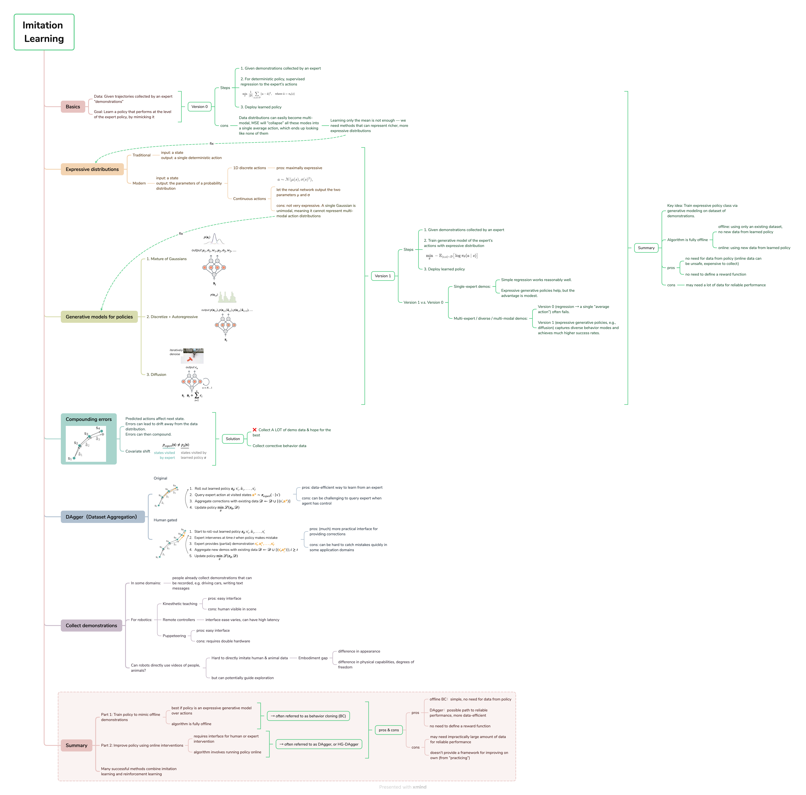
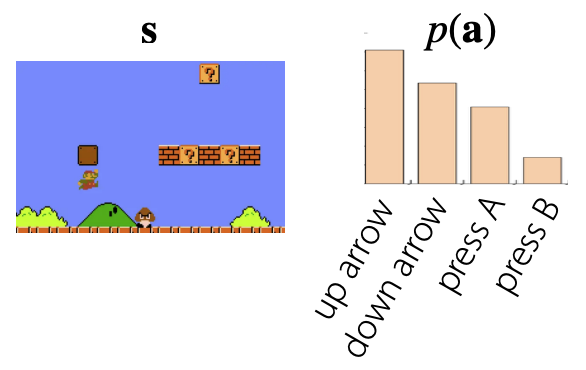
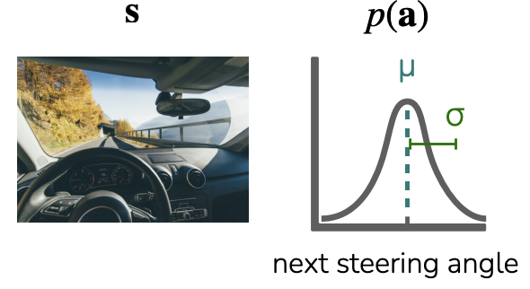
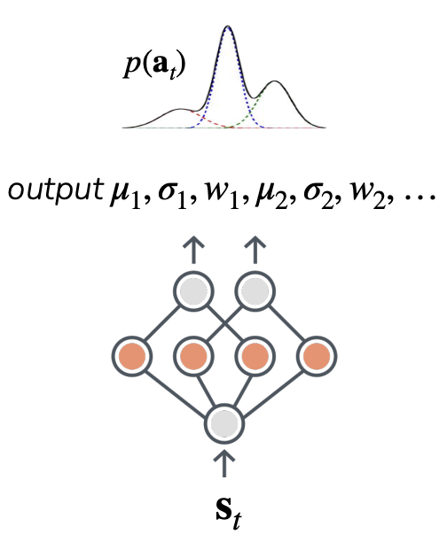
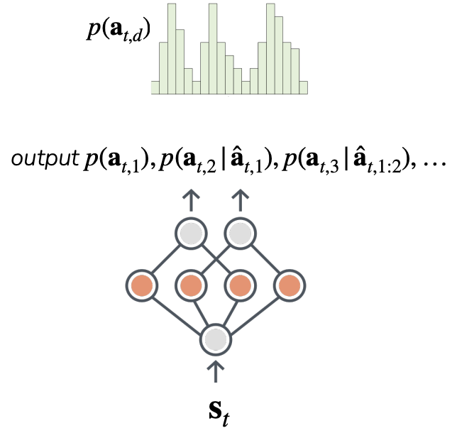
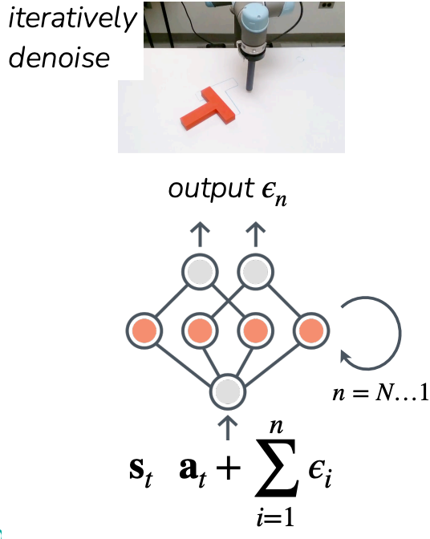
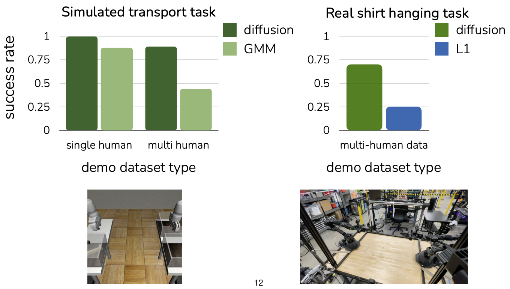
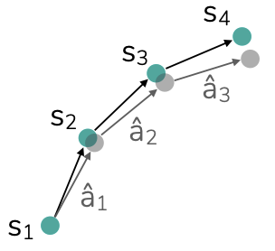
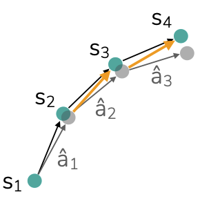
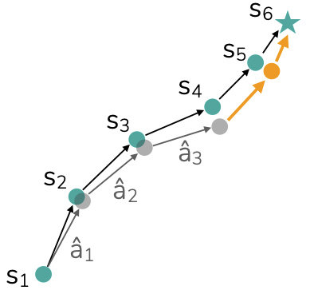

# Imitation Learning

> **Recap**
> - state $s_t$ - the state of the “world” at time $t$
> - observation $o_t$ - what the agent observes at time $t$
> - action $a_t$ - the decision taken at time $t$
> - trajectory $\tau$ - sequence of states/observations and actions $(s_1, a_1, s_2, a_2, ..., s_T, a_T)$
> - reward function $r(s, a)$ - how good is $s, a$
> - policy $\pi(\mathbf{a}_t \mid \mathbf{s}_t)$ or $\pi(\mathbf{a}_t \mid \mathbf{o}_{t-m:t})$ - behavior, usually what we are trying to learn can be represented using a generative model

## Imitation learning basics

### Goal
- Data: Given trajectories collected by an expert “demonstrations” $\mathcal{D} := \{(s_1, a_1, \ldots, s_T)\}$ (sampled from some unknown policy $\pi_{\text{expert}}$)
- Goal: Learn a policy $\pi_\theta$ that performs at the level of the expert policy, by mimicking it.

### Version 0（deterministic policy）

> Deterministic policy：确定性策略——给一个状态 s，策略直接吐出一个确定的动作 $\hat a$，不是一个概率分布

#### Steps

1. Given demonstrations collected by an expert
$\mathcal{D} := \{(s_1, a_1, \ldots, s_T)\}$

2. For deterministic policy, supervised regression to the expert’s actions $$\min_{\theta} \ \frac{1}{|\mathcal{D}|} \sum_{(s,a)\in \mathcal{D}} \lVert a - \hat a \rVert^2, \quad \text{where } \hat a = \pi_\theta(s)$$
    > - $\frac{1}{|\mathcal{D}|}$：除以样本数，得到平均损失。
    >
    > - 把“模仿专家动作”当成一个普通的监督学习回归问题：给状态 s 作为输入，让神经网络输出动作 $\hat a$，让 $\hat a$ 尽可能接近专家给的 $a$（用均方误差度量），不断调 $\theta$ 把这个误差压到最小。

3. Deploy learned policy $\pi_\theta$

> **“Version 0 的模仿学习” = 用专家数据 (s,a) 做一遍最普通的监督学习（回归/分类），学到一个策略 $\pi_\theta$，然后拿它直接上场执行**

#### What could go wrong?

数据是从很多人收集出来的时候，不同人的偏好会叠在一起，
- 数据分布很容易变成“多峰的”，
- MSE 就会把这些都“压缩成一个平均动作”，反而学到谁都不像。

L2 会逼着模型输出 平均动作，这个平均动作往往是没人会真正执行的坏动作（比如开车压在两条车道线之间）

所以，仅仅学“均值”是不够的，我们需要能表示“更丰富的动作分布”的方法

## Learning expressive policy distributions

### Learning distributions with neural networks

- 传统版：网络输入状态 $s$，输出一个确定的动作 $\hat a$。

- 现在：网络输入状态 $s$，输出的是某个概率分布的参数，比如：离散动作的每个概率、或者高斯分布的 $\mu,\sigma$。有了这个分布，就可以在执行时 从分布里采样动作，得到随机策略 $\pi(a\mid s)$。

    - 1D discrete actions

        

        - 状态 $s$：游戏画面。

        - 动作 $a$：上、下、按 A、按 B ……（有限个按钮）。

        - 做法：神经网络输出 $p(\text{up}),\ p(\text{down}),\dots$ 然后 softmax 约束成一个 分类分布（categorical distribution）。

	    - 好处：**Maximally expressive**（表达能力最强）对于离散动作，只要给每个动作一个概率，就能表示任何分布形状。

    - Continuous actions

        

        - 状态 $s$：车前的摄像头画面。

	    - 动作 $a$：方向盘角度（连续值）。

        - 常见做法：假设 $a \sim \mathcal N(\mu(s), \sigma(s)^2)$, 神经网络输出 $\mu,\sigma$, 	这两个数就决定了一个 高斯分布。

        - 限制：单个高斯分布，单峰（unimodal），不能很好地表示多峰分布。所以只用 $\mu,\sigma$ 的高斯策略，表达能力有限（Not very expressive），解决不了“只学到平均值”的问题。

既然简单的高斯/均值不够用，那能不能直接借用 生成模型，来学一个超级有表达力的策略分布？

> - 文生图（扩散）：$p(\text{image} \mid \text{text})$
> - 语言模型（自回归）：$p(\text{next word} \mid \text{context})$
            
在模仿学习 / 强化学习里，我们真正想学的就是：$\pi(a \mid o) = p(\text{action} \mid \text{observations})$

> **我们可以把“学策略”看成 一个条件生成建模问题，既然扩散 / 自回归模型已经证明能学很复杂的分布，那我们也可以用这些强力生成模型来学 $p(a\mid o)$，从而得到一个非常 expressive 的 policy distribution，不再局限于“均值 + 单高斯”那种很弱的表示**

### Generative models for policies (approximating $p(a\mid s)$)

1. **Mixture of Gaussians**
    
    

    不再用 一个 高斯，而是用 多个高斯加权相加：$$p(a_t\mid s_t) = \sum_k w_k(s_t)\, \mathcal N\!\big(a_t;\mu_k(s_t),\sigma_k^2(s_t)\big)$$
    这样多峰（multimodal）的分布就可以被表示出来

2. **Discretize + Autoregressive**
    
    

    1. 思路 A：对连续动作做细粒度离散化
        > 比如方向盘角度 [-30^\circ,30^\circ] 分成很多小格，每一格当成一个“离散动作”。这样就又可以像分类问题那样，用直方图去表示复杂分布 p(a_t)
    
    2. 思路 B：动作是向量 → 做自回归建模
        > 假设动作 a_t 有好几个维度（比如：方向盘角度、油门、刹车……）。
        >
        > 我们用自回归方式建模：$$p(a_t\mid s_t) = p(a_{t,1}\mid s_t)\, p(a_{t,2}\mid s_t,a_{t,1})\, p(a_{t,3}\mid s_t,a_{t,1:2})\dots$$
        >
        > 神经网络每次输出下一个维度的条件概率，前面已经采样出的维度作为额外输入。
        >
        > 这样可以：处理高维动作；表达很复杂的依赖关系和多模态分布（因为是一步一步条件采样）

3. **Diffusion**

    

    思路：先从一个简单的噪声分布出发，通过多步去噪生成动作。

	> 从 $a_t^{(N)}$（非常 noisy 的动作）开始；
	> 
    > 每一步 $n$ 时，让网络看到状态 $s_t$ 和当前 noisy 动作 $a_t^{(n)}$，输出一个噪声估计 $\varepsilon_n$；
    >
	> 用这个估计去更新/去噪，得到下一步 $a_t^{(n-1)}$；
    >
	> 如此从 $n=N$ 一直做到 $n=1$，最终得到一个“干净”的动作样本 $a_t^{(0)}$

    理论上可以拟合极其复杂的动作分布（和图像扩散一样），特别适合那些“动作轨迹很有结构”的场景（机械臂、复杂操控等）

### Version 1

#### Steps

1. Given demonstrations collected by an expert
$\mathcal D := \{(s_1, a_1,\dots,s_T)\}$

2. Train **generative model** of the expert’s actions $$ \min_\theta\ -\ \mathbb{E}_{(s,a)\sim\mathcal D}\big[\log \pi_\theta(a\mid s)\big]$$ with expressive distribution $\pi(\cdot \mid s)$
    - $(s,a)\sim\mathcal D$：在训练时，从数据集中抽一个状态和专家动作

    - $\pi_\theta(a\mid s)$：我们的策略分布，在状态 $s$ 时对动作 $a$ 给出的概率（或概率密度）

    - $\log \pi_\theta(a\mid s)$：该动作在策略下的对数概率（log probability）

    - 目标：$\min_\theta - \mathbb{E}[\cdot]$ = 最大化平均 $\log \pi_\theta(a\mid s)$

3.	Deploy learned policy $\pi_\theta$

> **Imitation learning – version 1 = 把模仿学习看成一个条件生成建模问题：用表达力很强的 $\pi_\theta(a\mid s)$ 做生成模型，通过最大化示范动作的 log-likelihood 来训练，然后拿这个生成式策略去执行**

#### Version 1 vs Version 0

- L: Simulated transport task

    - 在多人的、行为多样的 demo 数据集上，表达能力更强的 Diffusion policy 明显比简单的 GMM 好很多

- R: Real shirt hanging task

    - 在真实复杂任务 + 多人示范的场景里，传统的 “状态 → 单一动作 + L1/L2 损失” 的 version 0 表现非常差，而表示整个动作分布的 Diffusion policy 成功率高了好几倍

- 当 demo 只来自单一专家，行为比较统一时，简单的回归方法也能做得不错，生成式策略有优势，但不那么夸张

- 当 demo 来自多个人 / 行为多样 / 分布多峰 时，Version 0（只学一个“平均动作”）很容易失败；Version 1（表达力强的生成式策略，比如 Diffusion）能更好地捕捉这些多样模式 → 明显更高的成功率

### Applications

1. Robotics: Imitation learning + expressive policies

    > 在机器人里，模仿学习早就不是“简单 L2 回归”了，
真正大规模好用的系统，大多都在用 Diffusion policy 或 离散 + 自回归 这种 “expressive policy distributions”

    - Physical Intelligence π₀ (家庭环境里的双臂机器人)
    - NVIDIA Gr00t N1 (工业/仓储环境里的双臂机器人)
    - Figure Helix (类人形机器人)
    - OpenVLA (桌面机械臂，做收拾、放物体等小任务)

2. Autonomous driving: Imitation learning + expressive policies

    > 在论文 / 新闻里看到的那些端到端自动驾驶系统，
底层也在用 “模仿学习 + 表达力很强的策略分布” ——
尤其是 离散化 + 自回归 这类方法

    - Waymo EMMA (一个端到端驾驶系统)
    - Wayve LINGO-2 (Wayve 的系统，把语言模型 + 驾驶融合在一起)

> **Summary**
>
> - Data from one consistent demonstrator >> Unimodal policy distribution is enough
>
> - Multimodal data, e.g. from multiple demonstrators >> Need expressive generative model for policy
>
> - Key idea: train expressive policy class via generative modeling on dataset of demonstrations
>
> - Algorithm is fully offline
> 
>   - offline: using only an existing dataset, no new data from learned policy
>   - online: using new data from learned policy
> 
> - Advs:
>
>   - no need for data from policy (online data can be unsafe, expensive to collect)
>
>   - no need to define a reward function
>
> - Disadvs:
>
>   - may need a lot of data for reliable performance

## Learning from online interventions

### Compounding errors

- Supervised learning: Inputs independent of predicted labels $\hat y$

- Supervised learning of behavior

    

    - Predicted actions affect next state. Errors can lead to drift away from the data distribution. Errors can then compound

    - Covariate shift: $p_{\text{expert}}(s) \neq p_{\pi}(s)$

        - 训练：在专家分布 $p_{\text{expert}}(s)$ 上做监督学习；

        - 测试/部署：策略控制环境，产生 $p_{\pi}(s)$；
        
        - 如果策略一开始就不完美 → 两个分布会逐渐偏离 → 误差越来越大

> **在普通监督学习里，输入不会被你预测结果影响；但在模仿学习（行为学习）里，你的动作会改变之后看到的状态，一点小错误就会把你带离专家访问过的状态分布，导致 state distribution shift（covariate shift） + compounding errors**

### Solution

1. Collect A LOT of demo data & hope for the best

    - 多多益善：疯狂收集更多专家演示，希望覆盖尽可能多的“奇怪状态”。

    - 问题：贵、慢，而且很难真的覆盖到所有 corner cases，只是凑运气

2. **Collect corrective behavior data**

    - 不是只收“完美轨迹”，而是：让当前学到的策略先跑起来，看它会跑到哪些奇怪状态，然后让专家在这些状态上给出正确动作。
	
    - 这样我们就收到了“在自己会犯错的分布上的额外监督信号”

### DAgger（Dataset Aggregation）

#### Original

1.	Roll out learned policy $\pi_\theta: s'_1, \hat a_1, s'_2, \hat a_2, \dots, s'_T$

    > 注意状态加了撇号 $s'_t$：这些是当前策略 $\pi_\theta$ 真的在环境里走出来的状态，不一定跟专家轨迹一样

2.	Query expert action at visited states $a^*_t \sim \pi_{\text{expert}}(\cdot \mid s'_t)$
    
    > 这里不一定要让专家接管，只要给出“标签动作”就行。

3.	Aggregate corrections with existing data $\mathcal D \leftarrow \mathcal D \cup \{(s'_t, a^*_t)\}$

4.	Update policy：用扩大的数据集 $\mathcal D$ 再训练（最小化 $\mathcal L(\pi_\theta, \mathcal D)$）

然后重复上述 1–4 步,每次策略都会在 自己常访问的状态分布 上被监督纠正，最终让 $p_\pi(s)$ 越来越接近 $p_{\text{expert}}(s)$，滚雪球的 error 也就被压下去了。

\+ data-efficient way to learn from an expert

\- can be challenging to query expert when agent has control

#### Human gated

1.	Start to roll-out learned policy $\pi_\theta: s'_1, \hat a_1, \dots, s'_t$
	
2.	Expert intervenes at time $t$ when policy makes mistake

3.	Expert provides (partial) demonstration: $s'_t, a^*_t, \dots, s'_T$
	
4.	Aggregate new demos with existing data $\mathcal D \leftarrow \mathcal D \cup \{(s_i, a^*_i)\}_{i\ge t}$

5.	Update policy $\min_\theta \mathcal L(\pi_\theta, \mathcal D)$

\+ (much) more practical interface for providing corrections

\- can be hard to catch mistakes quickly

> **Summary**
>
> 1. 问题：行为模仿会 covariate shift → 错误滚雪球。
>
> 2. 简单方案：多收 demo，祈祷覆盖到奇怪状态。
>
> 3. 更聪明方案：DAgger 类方法
>       - 让当前策略先跑，在它真的去到的状态上，让专家给出纠正动作；不断把这些纠正数据加回来训练 → 状态分布逐步对齐。
> 
>       - 具体有：
>           - 纯 query 专家动作版（原始 DAgger）；
>           - 专家接管一段轨迹的 human-gated 版本，更适合实际机器人 / 自动驾驶。

## Collect demonstrations

1. In some domains: people already collect demonstrations that can be recorded, e.g. driving cars, writing text messages

    > 这些领域 无需额外设计接口，你只是把已经存在的“人类行为轨迹”拿来当 demo

2. For robotics:

    1. Kinesthetic teaching（手把手拖动机器人）
        
        \+ easy interface
        
        \- human visible in scene

    2. Remote controllers

        interface ease varies, can have high latency

    3. Puppeteering

        \+ easy interface
        
        \- requires double hardware

### Embodiment gap

- difference in appearance

- difference in physical capabilities, degrees of freedom

> Can robots directly use videos of people, animals?
>
> - Hard to directly imitate human & animal data
>
>   - 视频里只有 观察（图像），没有“真正的动作指令”（肌肉力、扭矩等）；
>
>   - 即便你从视频里估计出人体骨骼姿态，怎么把这个姿态“重定向”到机器人关节也是个难题（自由度和极限都不同）。
>
> - but can potentially guide exploration
> 
>   从视频里估计出 目标运动轨迹，用视频定义“好行为长什么样”，然后让 RL 或其他方法在机器人动作空间里自己探索，
找到能实现类似效果的控制策略。

> **Summary**
>
> Part 1: Train policy to mimic offline demonstrations
>
>   - best if policy is an expressive generative model over actions
>
>   - algorithm is fully offline
>
> → often referred to as behavior cloning (BC)
>
> Part 2: Improve policy using online interventions
>
>   - requires interface for human or expert intervention
>
>   - algorithm involves running policy online
>
> → often referred to as DAgger, or HG-DAgger
>
> \+ offline BC：simple, no need for data from policy
>
> \+ DAgger：possible path to reliable performance, more data-efficient
>
> \+ no need to define a reward function
>
> \- may need impractically large amount of data for reliable performance 
>
> \- doesn’t provide a framework for improving on own (from “practicing”)
>
> Many successful methods combine imitation learning and reinforcement learning
>
>   - 模仿学习：给你一个“不错的起点 + 安全的基本行为”；
>
>   - 强化学习：在这个基础上，让智能体自己练习、在环境里优化 reward，
变得更强、更稳，甚至超过示范者。