# Offline Reinforcement Learning

> **Recap**
>
> 1. **Policy Gradient**（策略梯度，REINFORCE）：直接用回报来推策略怎么改
> 2. **Actor-Critic**：引入“评论员/裁判”（value/Q/advantage 估计器）来告诉策略哪些动作更好
> 3. **Off-Policy Actor-Critic**：把交互数据存进回放池（replay buffer），反复利用旧数据，提高样本效率
> 
>
> **Online RL with Policy Gradients (REINFORCE)**
> 
> Do more of the above average stuff, less of the below average stuff.
> 
> 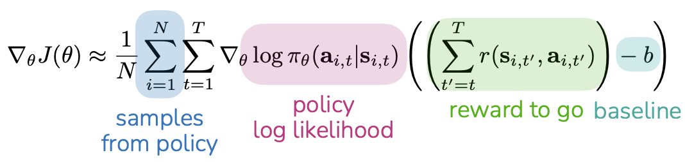
> 
> - $\nabla_\theta \log \pi_\theta(a|s)$：如果我要让动作 $a$ 在状态 $s$ 下更常发生，我该怎么改 $\theta$？
> - $(G_t - b)$：这次做的好不好？
>   - 若 $G_t > b$：是“高于平均”，这项为正 → 增加该动作概率
>   - 若 $G_t < b$：是“低于平均”，这项为负 → 减少该动作概率
> - 训练循环（online / on-policy）
>	1.	用当前策略跑环境，收集一批数据（episodes）
>	2.	计算每一步的 $G_t$
>	3.	用上式估计梯度
>	4.	更新参数（PPT 左下角）：$\theta \leftarrow \theta + \alpha \nabla_\theta J(\theta)$
>
> **Online RL with Actor-Critic**
>
> Why: REINFORCE 的 $G_t$ 波动很大（方差大），训练不稳定。加一个“critic”来估计“平均水平/未来收益”，让学习信号更稳。
>
> Estimate what is good and bad, then do more of the good stuff.
>
> 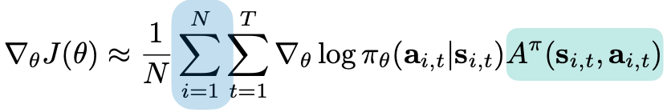
>
> 用 Advantage 代替 “回报-基线”。在状态 $s$ 下，做动作 $a$ 比“平均动作水平”好多少。
> 
> $$A^\pi(s,a)=Q^\pi(s,a)-V^\pi(s)$$
>
> The Critic's Methods
> 
> - Method 1: Estimate $V^\pi$ with Monte Carlo
>
>   $$ \min _\phi \sum_{\mathbf{s}_t \sim \mathcal{D}}\left\|\hat{V}_\phi^{\pi_\theta}\left(\mathbf{s}_t\right)-\sum_{t^{\prime}=t}^T r\left(\mathbf{s}_t, \mathbf{a}_t\right)\right\|^2 $$
> 
>   - 优点：无偏（用真实累计回报）
>   - 缺点：方差大、要等 episode 结束
>
> - Method 2: Estimate $V^\pi$ with Bootstrapped / TD updates
> 
>   $$\min _\phi \sum_{\left(\mathbf{s}, \mathbf{a}, \mathbf{s}^{\prime}\right) \sim \mathcal{D}}\left\|\hat{V}_\phi^{\pi_\theta}(\mathbf{s})-\left(r(\mathbf{s}, \mathbf{a})+\gamma \hat{V}_\phi^{\pi_\theta}\left(\mathbf{s}^{\prime}\right)\right)\right\|^2$$
>
>   - $r + \gamma \hat{V}(\mathbf{s}')$，用下一步的估值（$\hat{V}(\mathbf{s}')$）来更新这一步的估值。
>   - 优点：更新更频繁、更省样本
>   - 缺点：有偏（因为用自己预测的 \hat V(s')）
> 
> - Method 3: Estimate $Q^\pi$ with Bootstrapped / TD updates
>
>   $$ \min _\phi \sum_{\left(\mathbf{s}, \mathbf{a}, \mathbf{s}^{\prime}\right) \sim \mathcal{D}}\left\|\hat{Q}_\phi^{\pi_\theta}(\mathbf{s}, \mathbf{a})-\left(r(\mathbf{s}, \mathbf{a})+\gamma \mathbb{E}_{\mathbf{a}^{\prime} \sim \pi_\theta\left(\cdot \mid \mathbf{s}^{\prime}\right)}\left[\hat{Q}_\phi^{\pi_\theta}\left(\mathbf{s}^{\prime}, \mathbf{a}^{\prime}\right)\right]\right)\right\|^2 $$
>
>   - 用下一步“按策略会选的动作 $a$”来构造目标（target）
>   - 和方法2区别：
>       - $V^\pi$ (State Value) 是评价“现在的局势好不好”。
>       - $Q^\pi$ (Action Value) 是评价“在这个局势下，做这个动作好不好”。
>   - 同样用了 $r + \gamma ...$ 的结构，这叫“自举”（Bootstrapping），即利用自己的预测来更新自己。
>
> **Full Off-Policy Actor-Critic Method**
> 1. 与环境交互：$a\sim \pi_\theta(a|s)$，得到 $(s,a,s',r)$，存入 $\mathcal{R}$
> 2. 采样 batch：从 $\mathcal{R}$ 取 $\{(s_i,a_i,r_i,s_i')\}$
> 3. 更新 critic（学 $Q$）：目标 
>   $$y_i=r_i+\gamma \hat Q_\phi(s_i',a_i')\quad \text{其中 }a_i'\sim\pi_\theta(\cdot|s_i')$$
> 4. 更新 actor（策略梯度）：让策略更倾向于选择 critic 评为高分的动作
>   $$\nabla_\theta J(\theta)\approx \frac{1}{N}\sum_i \nabla_\theta \log \pi_\theta(a_i^\pi|s_i)\;\hat Q_\phi(s_i,a_i^\pi)$$
> 5. 梯度上升更新：
>   $$\theta \leftarrow \theta + \alpha \nabla_\theta J(\theta)$$
>
> **Summary**
>
> - Actor（策略）：负责“选动作”
> 
> - Critic（价值/Q/优势）：负责“打分动作好不好”
> 
> - 更新规则：
> 
>   - 打分高 → 增加该动作概率
> 
>   - 打分低 → 减少该动作概率
> 
> - REINFORCE：用真实回报打分（方差大）
> 
> - Actor-Critic：用 critic 估计打分（更稳）
> 
> - Off-policy：把数据存起来反复训练（更省样本）

## Why offline RL?

### Online RL v.s. Offline RL

- **Online RL**
  
  - 核心流程：边交互边学习
    - Collect data
    - Update policy on latest data or data so far
    
    > 数据是“活的”，策略更新会影响你接下来收集到的数据。

  - On-policy：主要用“当前策略”采集的数据训练（如 PPO）
  - Off-policy：可以反复用过去数据（如 DDPG/SAC + replay buffer）

- **Offline RL**

  - 核心流程：只给你一份固定数据集，不再与环境交互
    - Given static dataset：拿到一份静态数据集 $\mathcal{D}$
    - Train policy on dataset：只在这份数据上训练策略
    
    > 数据是“死的”，训练过程中你不能再去环境里试错采新样本。

  - Offline dataset $\mathcal D : \{(s, a, s', r)\}$ sampled from some unknown policy $\pi_\beta$, $\pi_\beta$may be a mixture of policies
    - 比如：不同人开车的数据混在一起、不同版本控制器产生的数据混在一起

  - $s \sim p_{\pi_\beta}(\cdot)$，在行为策略 $\pi_\beta$ 的长期运行下，会经常遇到某些状态（这就是状态分布）
  - $a \sim \pi_\beta(\cdot|s)$，动作由行为策略决定
  - $s' \sim p(\cdot|s,a)$，环境规则（物理世界/仿真器）决定做了下一个状态
  - $r = r(s,a)$，奖励由奖励函数给出
  - Objective:
    $$\max_{\theta}\; \mathbb E_{p_\theta(\tau)}\Big[\sum_t r(s_t,a_t)\Big]$$
    我们要找一组参数 $\theta$，定义一个“学出来的策略”  $\pi_\theta$，让它在环境中跑出来的轨迹 $\tau$（trajectory）上，累计奖励 $\sum_t r$ 的期望最大
    - **distribution shift**: 训练用的数据分布 ≠ 部署时策略真正会遇到的分布
    - 数据来自：行为策略 $\pi_\beta$ 的分布（它常去的状态、常做的动作）
    - 你要学的策略是：$\pi_\theta$，它可能会去“数据里很少出现”的状态/动作
  - Where does the data come from?
    - human collected data
    - data from a hand-designed system / controller
    - data from previous RL run(s)
    - a mixture of sources

### Why, or when, might offline RL be more useful?

- leverage datasets collected by people, existing systems
  - 人类操作记录（驾驶、医疗、客服）
  - 现有系统日志（推荐系统、广告投放、工业控制）
  
- online policy collection may be risky, unsafe

- reuse previously collected data rather than recollecting (e.g. previous experiments, projects, robots, institutions)

**A blend of offline then online RL is also possible**

1. 先 offline 预训练：用历史数据学到一个“还不错、相对安全”的初始策略

2. 再 online 微调：在可控环境/小流量/安全约束下继续提升
这样既省样本，又降低上线试错风险。

### Can we just run off-policy methods?

> Recall: 
> 
> Off-policy actor & critic updates (e.g. SAC)
> 
> $$\min_\phi \sum_{(s,a,s')\sim\mathcal D} \left\|\hat Q_\phi(s,a)-\Big(r(s,a)+\gamma\mathbb E_{a'\sim\pi_\theta(\cdot|s')}[\hat Q_\phi(s',a')]\Big)\right\|^2$$
>
> **策略会倾向于选择 Q 值更高 的动作**

**What happens if you optimize this using a static dataset?**

> data support: 数据集中出现过/比较常出现的动作区域
> 
> 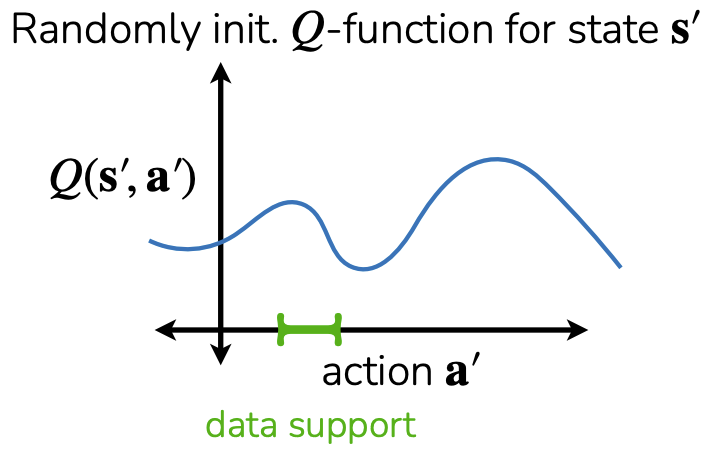
> 
> out-of-distribution (OOD) actions: 在某个状态 $s$ 下，策略可能提出一个动作 $a$，但这个动作在数据集里很少出现，甚至从未出现

- Q-function will be unreliable

- policy will seek out actions where Q-function is over-optimistic

- After policy update, Q-values will become substantially overestimated

- Another perspective: learned policy deviates too much from behavior policy

> 为什么在线 off-policy（比如 SAC）通常没这么惨？
> 
> - 在线时：如果策略尝试了新动作 a'，环境会给你真实反馈，你会把它加入 buffer，critic 很快就能纠正。
> - 离线时：你永远拿不到新动作的真实反馈，critic 没法纠错，只能越错越离谱。

## How to mitigate overestimation in offline RL

### Implicit policy constraint methods

#### offline RL v.s. imitation learning

- Imitation methods can’t outperform the expert

- Offline data may not be optimal, but

    - Offline RL can leverage reward information to **outperform behavior policy**.
     
    - Good offline RL methods can **stitch together good behaviors**: 拼接数据里零散出现的优质局部行为，组成更长、更优的整体策略
      
        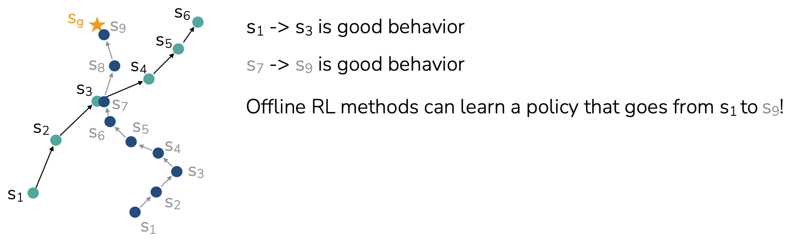

||IL / Behavior Cloning|Offline RL|
|---|---|---|
|学什么|拟合数据动作分布 $\pi(a\|s)$，像监督学习|用 reward 学“哪些动作更好”，目标是最大回报|
|依赖什么|不一定需要奖励（很多 BC 不用 reward）|需要奖励信号（或可构造的 reward）|
|上限|通常不超过数据/专家水平（数据一般 → 学出来也一般）|可以超过行为策略（因为它会偏向高回报行为）|
|优点|稳定、实现简单，比较不容易出现 “Q 虚高” 那类问题|能“筛选 + 拼接”好片段|
|缺点|不会“挑更好的做”，只会“照着做”|容易遇到分布外动作（OOD）导致 Q 估计不准，需要专门的保守/约束方法|

> Summary:
> 
> 1. IL：学得像数据（数据好就好，数据一般就一般）
> 
> 2. Offline RL：用奖励挑更好的做，并把好片段拼起来（但要处理 OOD 和 Q 过估计风险）

#### Simple way: Filtered Behavior Cloning

If we have reward labels: imitate only the good trajectories? >> Filtered Behavior Cloning

1. Rank trajectories by return
   $$r(\tau)=\sum_{(s_t,a_t)\in \tau} r(s_t,a_t)$$
   - $\tau$ 是一条完整轨迹（一次 episode）
   - $r(\tau)$ 是该轨迹的总回报（把每一步奖励加起来）

2. Filter dataset to include top k% of data
   $$\tilde{\mathcal D}=\{\tau \mid r(\tau)>\eta\}$$
   - $\eta$ 是阈值（比如回报位于前 10% 的分数线）
   - $\tilde{\mathcal D}$ 是过滤后的数据集（只含高回报轨迹）
  
3. Imitate filtered dataset
   $$\max_\theta \sum_{(s,a)\in \tilde{\mathcal D}} \log \pi_\theta(a|s)$$
    标准 BC 让模型在状态 $s$ 下尽可能输出数据里的动作 $a$，只不过现在训练数据变成“高回报轨迹里的状态-动作对”

> Summary:
> 
> - Filtered BC = 用回报挑数据 + 再做 BC
> 
> - 优点：简单、常比纯 BC 强、很适合作基线
> 
> - 缺点：粒度粗（按整条轨迹筛）、不会规划/拼接、仍受模仿上限约束

#### Better way: weighted imitation learning

weight each transition depending on how good the action is

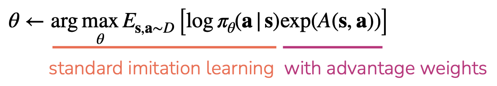

- $\exp(A(s,a))$: 给每个样本一个权重：动作越好（优势越大），权重越大；动作越差，权重越小
- Why exp?
  - 确保权重为正
  - “好一点”会被更明显地放大（更偏向学好动作）
- Advantage of which policy? 
  - $\pi_\beta$
  - 用“数据生成者的标准”判断这个动作在当时算不算好
- advantage-weighted objective approximates KL-constrained objective
  $$\pi_{\text{new}}=\arg\max_\pi \mathbb E_{a\sim\pi(\cdot|s)}[Q(s,a)] \quad \text{s.t. } D_{KL}(\pi\|\pi_\beta)<\epsilon$$

How to estimate the advantage function? >> **Advantage-weighted regression（AWR）**

思路：别去学/查询 OOD 动作的 Q，而是用数据里真实回报（Monte Carlo）去构造一个“在数据上可靠”的优势信号，然后做加权模仿

1. First simple approach
   
   1. Estimate $V^{\pi_\beta}(s)$ with Monte Carlo: 
   $$\min_\phi \sum_{s_t\sim\mathcal D} \left\|\hat V_\phi^{\pi_\beta}(s_t) - \sum_{t'=t}^{T} r(s_{t'},a_{t'})\right\|^2$$
   2. Approximate 
   $$\hat A^{\pi_\beta}(s_t,a_t)=\sum_{t'=t}^{T} r(s_{t'},a_{t'}) - \hat V_\phi^{\pi_\beta}(s_t)$$

2. Full AWR algorithm
   
   1. Fit value function: 
   $$\min_\phi \sum_{s_t\sim\mathcal D} \left\|\hat V_\phi^{\pi_\beta}(s_t) - \sum_{t'=t}^{T} r(s_{t'},a_{t'})\right\|^2$$
   2. Train policy:
   $$\max_\theta \;\mathbb E_{(s_t,a_t)\sim\mathcal D} \left[\log\pi_\theta(a_t|s_t)\;\exp\left(\frac{1}{\alpha}\Big(\sum_{t'=t}^{T} r(s_{t'},a_{t'})-\hat V_\phi^{\pi_\beta}(s_t)\Big)\right)\right]$$

pros:

\+ Simple

\+ Avoids querying or training on any OOD actions (AWR 的训练只用数据里出现的 (s_t,a_t))

cons:

\- Monte Carlo estimation is noisy

\- $\hat A^{\pi_\beta}$ is for weaker policy than $\hat A^{\pi_\theta}$

> Summary:
>
> AWR = 用离线轨迹的真实回报训练一个 $V$，再用 $\exp(\text{回报}-V)$ 给样本加权做行为克隆。
> 
> 它站在“离线安全”的角度，尽量避免 Q 在 OOD 动作上乱估导致的崩盘。

#### Want to estimate advantages using TD updates, without querying $Q$ on OOD actions

AWR 用 Monte Carlo 回报估优势：简单但噪声大，而且优势是相对 $\pi_\beta$ >> 想用 TD（Temporal Difference）更新来估优势（更省样本、方差更小），但又不想在 OOD 动作上查询 Q（避免离线 RL 常见崩溃）

标准 critic 目标会有：
$$ r + \gamma \mathbb{E}_{a'\sim \pi(\cdot|s')}Q(s',a') $$
这里的 $a'$ 来自当前学的策略 $\pi$，很可能是数据里没出现过的动作（OOD）→ Q 外推不准 → 过估计 → 策略钻空子

把 $a' \sim \pi(\cdot|s')$ 改成 $a' \sim \mathcal D$，也就是 **Gives Q-function estimate for $\pi_\beta$, not $\pi_\theta$**，下一个动作不从当前策略采样，而是从数据集里拿（行为策略产生的动作）

AWAC update:
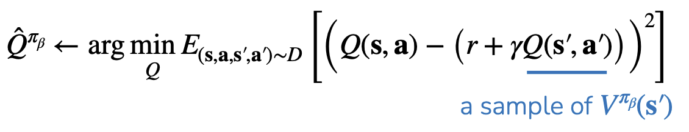

estimate Q for a policy that is better than $\pi_\beta$ >> Use an asymmetric loss function >> 让你学到的 $V(s)$ 不是“平均水平”，而更像“偏高分位”的水平

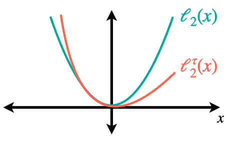

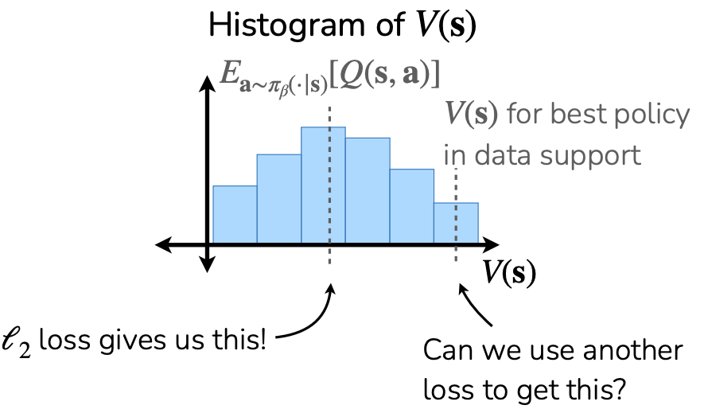

- 用普通 $L_2$（均方误差）回归，学到的是均值（图里中间虚线）
  
- 我们更想要的是“数据支持范围里最好的那部分行为”的价值（右边虚线），所以要换一种损失，让回归结果偏向高分（或低分）

#### Expectile regression

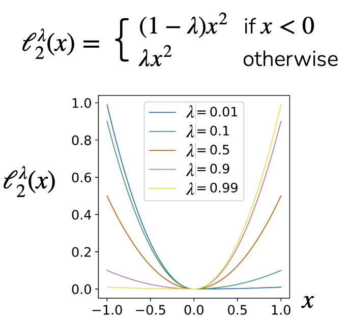

其中 x 是“预测误差”（预测 - 目标）

> Example:
> 
> 当预测 低于目标（误差为负）时，用系数 $1-\lambda$
> 
> 当预测 高于目标（误差为正）时，用系数 $\lambda$
> 
> 如果取 $\lambda<0.5$：
>   - $\lambda$ 小 → “预测过高”的惩罚较轻
>   - “预测过低”的惩罚较重 → 模型倾向于把预测推高 → 拟合到一个偏高的 expectile（类似高分位）
>
> $$x = V(s) - Q(s,a)$$
> $$A(s,a) = Q(s,a) - V(s) = -x$$
> $x<0 \iff A>0$（动作比 baseline 更好）

#### IQL（Implicit Q-Learning）

##### Goals：

- 用 TD（降低噪声）
- 又不对 OOD 动作做 $\max$ 或 $\mathbb{E}_{a'\sim\pi}$
- 并且能隐式偏向更好的行为（通过 expectile）

##### Steps:

1. Fit $V$ with expectile loss:
   $$\hat V(s)\leftarrow \arg\min_V\; \mathbb E_{(s,a)\sim\mathcal D}\big[\ell_2^\lambda\big(V(s)-\hat Q(s,a)\big)\big] \quad (\lambda<0.5)$$

2. Update $Q$ with typical MSE loss:
   $$\hat Q(s,a)\leftarrow \arg\min_Q\; \mathbb E_{(s,a,s')\sim\mathcal D}\Big[\big(Q(s,a)-(r+\gamma \hat V(s'))\big)^2\Big]$$
   TD target 用的是 $\hat V(s')$，没有出现 $a'\sim \pi$ → 不需要查询 OOD 动作

3. Extract policy with AWR: 
   $$\hat\pi \leftarrow \arg\max_\pi\; \mathbb E_{(s,a)\sim\mathcal D}\Big[\log\pi(a|s)\exp\Big(\frac{1}{\alpha}(\hat Q(s,a)-\hat V(s))\Big)\Big]$$

##### pros:

- **Never need to query OOD actions**：target 不需要 $\pi$ 采样动作
- **Policy only trained on actions in data**：策略学习是加权 BC，动作来自数据
- **Decoupling actor & critic training**：critic（$Q$/$V$）和 actor（$\pi$）分开训练，计算更快、更稳定

##### 拼接发生在：不同轨迹在某些状态相遇（或状态相似）时，价值信息会通过 TD 传播，把后面那段好回报“传回”到前面另一条轨迹上。

### Conservative Q-Learning

思路：对“可能出现的动作”整体施加一个向下的压力，让 $Q$ 别轻易变大；同时保证数据里的 $(s,a)$ 不被压得太低

#### push down on large Q-values

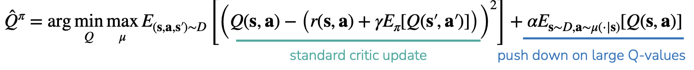

#### push up on Q-values for $(s,a)$ in the data

No longer guaranteed that for $\hat{Q}^\pi \leq Q^\pi$ all $(s,a)$. 

BUT, guaranteed that $E_{\pi(\mathbf{a} \mid \mathbf{s})}\left[\hat{Q}^\pi(\mathbf{s}, \mathbf{a})\right] \leq E_{\pi(\mathbf{a} \mid \mathbf{s})}\left[Q^\pi(\mathbf{s}, \mathbf{a})\right]$ for all $\mathbf{s} \in D$.

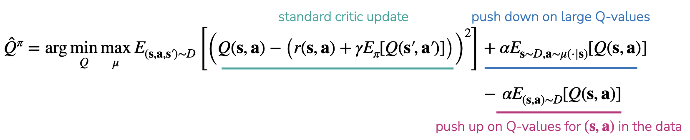

##### 效果:

- 对“广泛动作集合”上的 Q：往下压（防止 OOD 虚高）
- 对“数据动作”上的 Q：往上抬（别把真见过的好动作压没了）

##### $\max_\mu$:

我们让一个“对手分布” $\mu(a|s)$ 专门挑那些会让 $\mathbb E_{a\sim\mu}Q(s,a)$ 变大的动作。然后我们再最小化 Q，把这些可能虚高的区域压下去。

##### full algorithm:

1. Update using using $\hat{Q}^\pi$ using $L_{\text{CQL}}$ using $D$
   
    Don’t need to construct $\mu$ directly
    
    给 $\mu$ 加一个最大熵正则 $R(\mu)$
    
    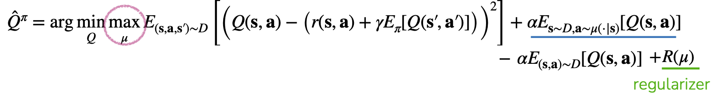
    
    $$R(\mu)=\mathbb E_{s\sim\mathcal D}[\mathcal H(\mu(\cdot|s))]$$
    
    With max entropy regularizer $R$, optimal $\mu(a|s)\propto \exp(Q(s,a))$

    > **log-sum-exp**: “线性期望 + 熵正则”的最优分布是 Boltzmann（softmax）分布。这是最大熵原理、也等价于熵的凸共轭（log-sum-exp）关系。

    Then

    $$E_{\mathbf{s} \sim D, \mathbf{a} \sim \mu(\cdot \mid \mathbf{s})[Q(\mathbf{s}, \mathbf{a})]}=\log \sum_{\mathbf{a}} \exp (Q(\mathbf{s}, \mathbf{a}))$$
  

2. Update policy $\pi$
   
   - If actions are discrete:
  
     $$\pi(\mathbf{a} \mid \mathbf{s})=\left\{\begin{array}{l} 1 \text { if } \mathbf{a}=\arg \max_{\overline{\mathbf{a}}} \hat{Q}^\pi(\mathbf{s}, \overline{\mathbf{a}}) \\ 0 \text { otherwise }\end{array}\right.$$
     
   - If actions are continuous:
  
     $$ \theta \leftarrow \theta+\eta \nabla_\theta E_{\mathbf{s} \sim D, \mathbf{a} \sim \pi_\theta(\cdot \mid \mathbf{s})}\left[\hat{Q}^\pi(\mathbf{s}, \mathbf{a})\right] $$

> **Summary**
>
> Why offline RL?
>   - Online data is expensive
>   - Reusing offline data is good
>
> Key challenge: Overestimating Q-values because of shift between $\pi_\beta$ and $\pi_\theta$
>   
> 分布偏移：$\pi_\theta$ 会选一些数据里没怎么出现过的动作（OOD），而 Q 网络在这些区域容易乱估并虚高 → 策略追着虚高 Q 跑 → 崩
>
> Approaches
>
> 1. filtered / weighted imitation learning
> 
>       - 代表：Filtered BC、Advantage-weighted imitation、AWR
>       - 做法：仍然主要做“模仿数据动作”，但：
>          - 要么只学高回报轨迹（filtered）
>          - 要么对更好的样本加权（weighted）
>       - 优点：简单、稳、实现像监督学习
>       - 缺点：提升受限（更像“选好数据再模仿”）
> 
> 2. implicit constrain policy 
>
>       - 代表：IQL（以及 AWAC 这类思想）
>       - 只在数据动作上训练策略，让策略不要离数据太远；同时通过价值学习实现“轨迹拼接/改进”。
>           - 策略不去搜 OOD 动作（所以更稳）
>           - 但通过学到的 Q/V 的结构，仍可能把数据里的好片段 stitch 起来 → 超过纯模仿
> 
> 3. construct conservative objective by penalizing Q
>
>       - 代表：CQL
>       - 对“可能虚高的 Q”施加惩罚，让 Q 不容易在 OOD 区域变得很大，从而避免策略被虚高 Q 误导。
>
> Trajectory stitching allows offline RL methods to improve over imitation
>
> Which offline RL algorithm to use? 
>
> - If you only want to train offline:
>       
>   - Filtered behavior cloning: Good first approach to using offline data.
>   - Implicit Q-learning: Can stitch data & explicitly constrained to data support
>   - Conservative Q-learning: Just one hyperparameter
>
> - If you want offline pre-training + online fine-tuning: 
>   - Implicit Q-learning: Seems most performant
>
> - 先跑通/做基线：Filtered BC
> - 想稳且能超过模仿（纯离线也行）：IQL
> - Q 虚高特别严重、想强保守：CQL
> - 要 offline→online 的路线：优先考虑 IQL