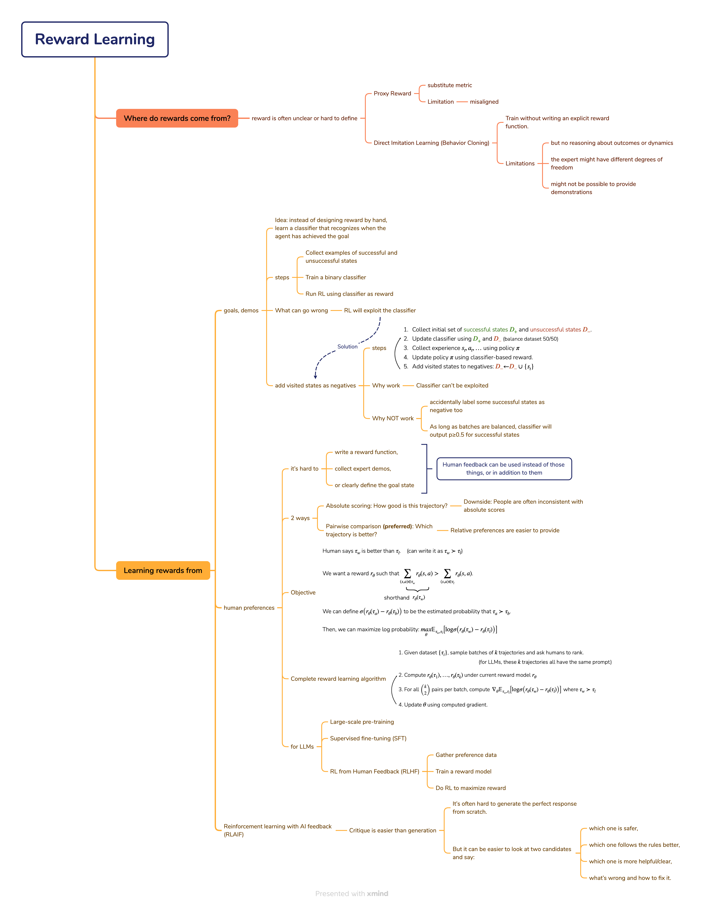
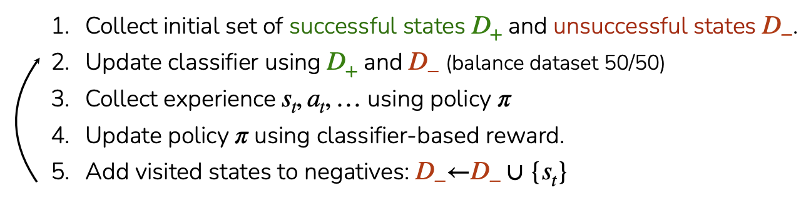

# Reward Learning

## Where do rewards come from?

RL needs a reward signal to learn what is good or bad behavior.

But in the real world, the reward is often unclear or hard to define 

### Proxy Reward

A proxy reward is a substitute metric. Proxy rewards can be **misaligned** with what humans actually want.

> Example:
> 
> “Drive fast” might be used as a proxy for “good driving”
>
> But it can cause problems if it doesn’t match the true goal (e.g., speeding unsafely)

### Direct Imitation Learning (Behavior Cloning)

Mimic the actions of an expert

> Learn a policy by supervised learning: In state s, the expert chose action a → copy that mapping.

**Advantage**

Train without writing an explicit reward function.

**Limitations**
- but no reasoning about outcomes or dynamics
  
  > not understand why they work
  > 
  > fail when the environment changes

- the expert might have different degrees of freedom
  
  > have different bodies/controls
  >
  > Example: human hand vs robot gripper; human driving controls vs autonomous system

- might not be possible to provide demonstrations
  
  > Some scenarios are too risky to demonstrate (e.g., crash-avoidance edge cases)

## Learning rewards from example goals, behaviors

Idea: instead of designing reward by hand, learn a classifier that recognizes when the agent has achieved the goal

**Goal classifier**: a model that decides whether a state looks like a goal/success state.

- **Input**: current state s (often an image from a camera)
- **Output**:
  - 1 (success / goal reached)
  - 0 (not success)

Then we use the classifier’s output as the reward signal for RL.

**Training + RL pipeline**

1. Collect examples of successful and unsuccessful states (states inside/outside the goal set G)

2. Train a binary classifier
   - Input: states $s_i$
   - Label: $\mathbf{1}(s_i \in G)$ (1 if state is in goal set $G$, else 0)

3. Run RL using classifier as reward

### What can go wrong >> RL will exploit the classifier

The RL algorithm will seek out states that the classifier thinks are good.

It may simply find states that the classifier wasn’t trained on.

> Example:
>
> 任务：把笔袋放到笔记本后面。
> 
> - 正样本：笔袋在后面
> - 负样本：笔袋不在后面
>
> RL 可能学到的:
>
> 1. 遮挡摄像头/改变视角
> 2. 把笔袋推到画面边缘/出画
> 3. 利用背景相关性（spurious correlation）

### Fix: add visited states as negatives

As RL explores, collect the states it visits and treat them as negative examples for the classifier.

**Steps**

**Why might this work?**

- If RL finds classifier loopholes, those loophole states get added to $D_-$.
- Next classifier update pushes those states toward output 0.
- So the classifier becomes harder to exploit over time.

Best-case outcome: the classifier becomes accurate in the regions of state space the policy actually visits.

**Why might it NOT work?**

If you automatically label all visited states as negative, you may accidentally label some successful states as negative too.

That can cause:
- Confusing training signal
- Classifier uncertainty
- Slower learning or wrong reward

As long as batches are balanced, classifier will output $p≥0.5$ for successful states

> This is also how GANs (Generative adversarial networks) work:
>
> 1. Train classifier to discriminate between real data and generated data
> 
> 2. Train generator to generate data that the classifier thinks is real
>
> At convergence: generator will match data distribution p(x)

> **Summary**
>
> - Pre-trained classifiers can be exploited when optimized against
> 
> - Solution: Update the classifier during RL, using policy data as negatives
>
> - Can learn a goal classifier with success examples, full reward with demos
>   
>   > 只靠成功结果就能训练目标分类器；如果有演示数据，还能得到更完整、更有信息量的奖励（不仅终点，过程也能指导）
>
> - Pros / Cons
>
>   - \+ practical framework for task specification
>   - \~ adversarial training can be unstable
>   - \- requires examples of desired behavior or outcomes

## Learning rewards from human preferences

### Can humans provide feedback on policy roll-outs?

> A **roll-out** is what happens when you run that policy in the environment: it produces a **trajectory**.

Instead of requiring expert demos or example goal states, can we simply ask humans to judge the agent’s trajectories?

**Why do we want this?**

In many real-world tasks, it’s hard to:
- write a reward function,
- collect expert demos,
- or clearly define the goal state.

Human feedback can be used **instead of** those things, or **in addition to** them.

**Two ways humans can give feedback**

1. Absolute scoring: How good is this trajectory?

    Downside: People are often inconsistent with absolute scores:
      - “Is this a 6 or a 7?” is hard.
      - Different humans (or the same human on different days) may score differently.

2. Pairwise comparison (preferred): Which trajectory is better?

    **Relative preferences are easier to provide** 

### How to learn a reward function from human preferences?

**Idea**

1. A human compares two trajectories and says $\tau_w$ is better than $\tau_l$ (winner vs loser), written as $\tau_w \succ \tau_l$

2. If the human prefers $\tau_w$ over $\tau_l$, we want $r_\theta(\tau_w) > r_\theta(\tau_l)$, where $r_\theta(\tau)=\sum_{(s,a)\in\tau} r_\theta(s,a)$

3. Define the probability that $\tau_a$ is preferred over $\tau_b$ as: $P(\tau_a \succ \tau_b)=\sigma\big(r_\theta(\tau_a)-r_\theta(\tau_b)\big)$

4. Then, we can maximize log probability: $\max_\theta \; \mathbb{E}_{\tau_w,\tau_l}\Big[\log \sigma\big(r_\theta(\tau_w)-r_\theta(\tau_l)\big)\Big]$

**Complete reward learning algorithm**

Goal: learn $r_\theta$ from a dataset of trajectories and human rankings.

1. Sample a batch of $k$ trajectories and ask humans to rank/compare them

   - For LLMs: often these trajectories come from the same prompt, so ranking is fair.

2. Compute predicted rewards for each trajectory:
$r_\theta(\tau_1),\dots,r_\theta(\tau_k)$

3. For every pair in the batch (there are $\binom{k}{2}$ pairs), compute the gradient of:
$\log \sigma(r_\theta(\tau_w)-r_\theta(\tau_l))$, where $\tau_w$ is the human-chosen winner.

4. Update $\theta$ using that gradient (gradient descent/ascent).

> This can be done online, inside an RL loop: policy generates trajectories → humans label preferences → update reward model → improve policy using RL on that reward.

### Full RLHF pipeline for LLMs

1. Large-scale pre-training
   - Train on lots of text using next-token prediction.
   - Result: a capable model, but with mixed quality and alignment.

2. Supervised fine-tuning (SFT)
   - Train on high-quality (prompt, response) examples written by humans.
   - Result: model outputs become more helpful/structured.

3. RL from Human Feedback (RLHF)
   
   1. Gather preference data
      
      - For each prompt $x$, sample multiple answers.
      - Humans rank or compare them (e.g., $y \succ y'$).

    2. Train a reward model
        
        Train $r(x,y)$ to predict human preferences.

    3. Do RL to maximize reward

         - Fine-tune the language model (the “policy”) so that for a given prompt, it produces responses with high $r(x,y)$.
         - In practice this is often done with policy-gradient style methods (e.g., PPO), but the slide is focusing on the concept.

### Learning rewards from AI feedback

RLAIF (Reinforcement Learning from AI Feedback): use AI feedback to generate the preference labels (or critiques) needed to train a reward model / do RL.

**Critique is easier than generation**

- It’s often hard to generate the perfect response from scratch.
- But it can be easier to look at two candidates and say:
  - which one is safer,
  - which one follows the rules better,
  - which one is more helpful/clear,
  - what’s wrong and how to fix it.

So AI can be used effectively as a critic (evaluator), even if it isn’t perfect as a generator.

> **Summary**
>
> Rewards can’t be taken for granted
>
> Two main approaches to reward learning
>
> 1. Learning rewards from goals / demos
>
> - Pros: Practical framework for task specification
> 
>   > You can define what you want by giving examples of success or expert behavior instead of writing a reward by hand.
> 
> - Caveat: Adversarial training can be unstable
>   > If the policy is optimizing against a learned classifier/reward model, it may exploit weaknesses (GAN-like instability).
>   >
>   > Stabilization often needs regularization tricks.
> - Cons: Requires examples of desired behavior or outcomes
>   > You need successful states, demonstrations, or labeled data—these can be costly or impossible to collect.
>
> 2. Learning rewards from human preferences
>
> - Pros: 
>       
>   - Pairwise preferences are easy to provide
>   - Has been deployed at scale
> - Cons: May require supervision in the loop of RL
>   > You may need to keep collecting new preference labels as the policy changes, which can require significant human time.
