# RL for LLMs: Preference Optimization

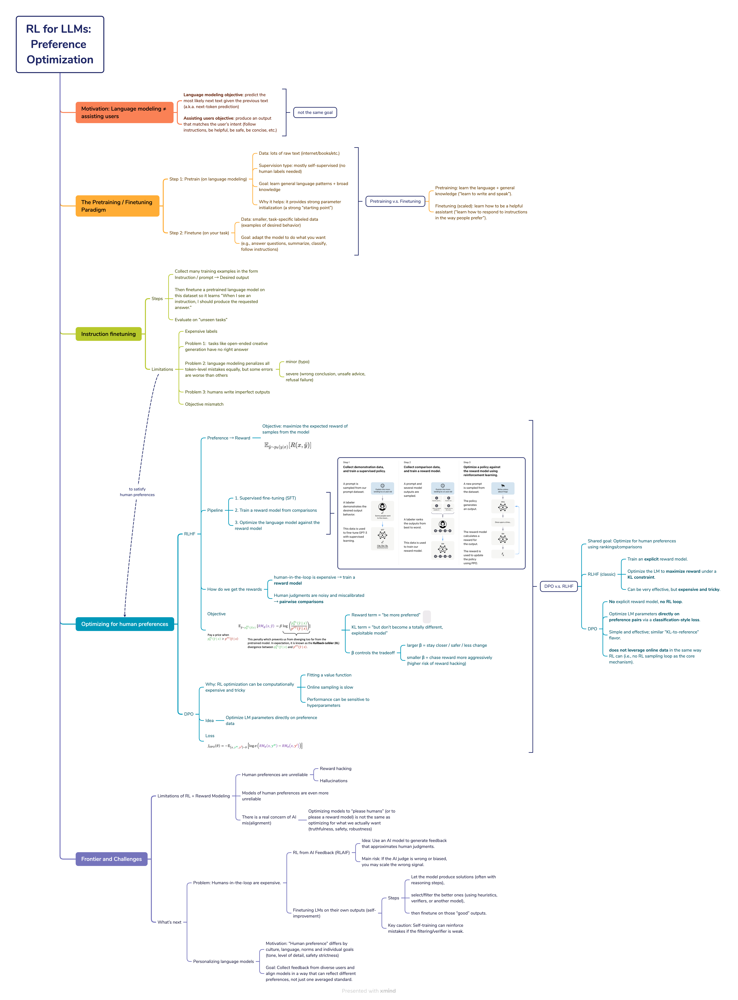

## Instruction finetuning

### Motivation: Language modeling ≠ assisting users

- **Language modeling objective**: predict the most likely next text given the previous text (a.k.a. next-token prediction).

- **Assisting users objective**: produce an output that matches the user’s intent (follow instructions, be helpful, be safe, be concise, etc.).

These are **not the same goal**, so a model trained only for language modeling can behave “wrong” from a user’s perspective.

#### Next-token prediction can miss user intent

high-probability continuation ≠ helpful answer

#### Alignment

The model’s outputs line up with what the user meant, not just what text is statistically likely

#### Solution idea: Finetuning to improve alignment

### The Pretraining / Finetuning Paradigm

#### Step 1: Pretrain (on language modeling)

- Data: lots of raw text (internet/books/etc.)

- Supervision type: mostly self-supervised (no human labels needed)

- Goal: learn general language patterns + broad knowledge

- Why it helps: it provides strong parameter initialization (a strong “starting point”)

#### Step 2: Finetune (on your task)

- Data: smaller, task-specific labeled data (examples of desired behavior)

- Goal: adapt the model to do what you want (e.g., answer questions, summarize, classify, follow instructions)

#### Pretraining v.s. Finetuning

- Pretraining: learn the language + general knowledge (“learn to write and speak”).

- Finetuning (scaled): learn how to be a helpful assistant (“learn how to respond to instructions in the way people prefer”).

### Scaling up finetuning

Finetune on many tasks/instructions so the model becomes a general assistant.

### Instruction finetuning (instruction tuning)

- Collect many training examples in the form **Instruction / prompt → Desired output**

- Then finetune a pretrained language model on this dataset so it learns “When I see an instruction, I should produce the requested answer.”

- Evaluate on “unseen tasks”

#### Limitations

1. Expensive labels

2. Problem 1: No single right answer

3. Problem 2: Token-level training doesn’t match human priorities

    > - Standard training penalizes mistakes token by token, roughly equally.
    > - But in real use:
    >   - Some mistakes are minor (typo),
    >   - others are severe (wrong conclusion, unsafe advice, refusal failure).

4. Problem 3: Humans write imperfect outputs

    > Even human-written “gold answers” can be inconsistent, unclear, or suboptimal.

5. Objective mismatch

    > 就算做了 instruction finetuning，模型训练时“真正被优化的目标”仍然和“人类真正想要的目标”不完全一致。Instruction finetuning 让模型更会“按样例回答”，但并没有直接让模型去优化“让人满意”这件事

**\>> Can we optimize explicitly for “satisfy human preferences”?**

## Optimizing for human preferences (DPO/RLHF)

### Basic setup

- Same input article $x$ → model generates two summaries $y_1$ and $y_2$

- Humans give the reward score $R(x, y_1)$ and $R(x, y_2)$

- Training goal: make the model more likely to generate high-reward outputs

- Objective: maximize the expected reward of samples from the model 
    
    $$\mathbb{E}_{\hat{y}\sim p_\theta(y|x)}[R(x,\hat{y})]$$

- Doing gradient ascent:

    $$\theta_{t+1} := \theta_t + \alpha \, \nabla_{\theta_t} \mathbb{E}_{\hat{s} \sim p_{\theta_t}(s)} \big[ R(\hat{s}) \big]$$

    - How do we estimate this expectation?

    - What if the reward function is non-differentiable?

    **\>>** policy gradient
    
    > **Recap: REINFORCE**
    >
    > We want: $\nabla_\theta \mathbb{E}_{\hat{s}\sim p_\theta(s)}[R(\hat{s})]$
    >
    > 
    >
    > log-derivative trick:
    >
    > 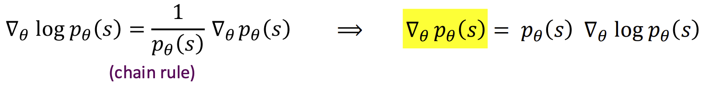
    >
    > 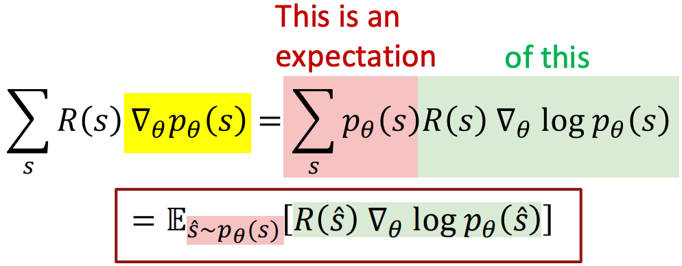
    >
    > Now the gradient is written as an expectation, so we can estimate it by sampling
    >
    > Monte Carlo approximation:
    >
    > $$\mathbb{E}\left[ R(\hat{s}) \nabla_\theta \log p_\theta(\hat{s}) \right] \approx \frac{1}{m}\sum_{i=1}^m R(s_i)\nabla_\theta \log p_\theta(s_i)$$
    >
    > We reinforce good actions, increasing the chance they happen again
    >
    > Gradient ascent step:
    >
    > 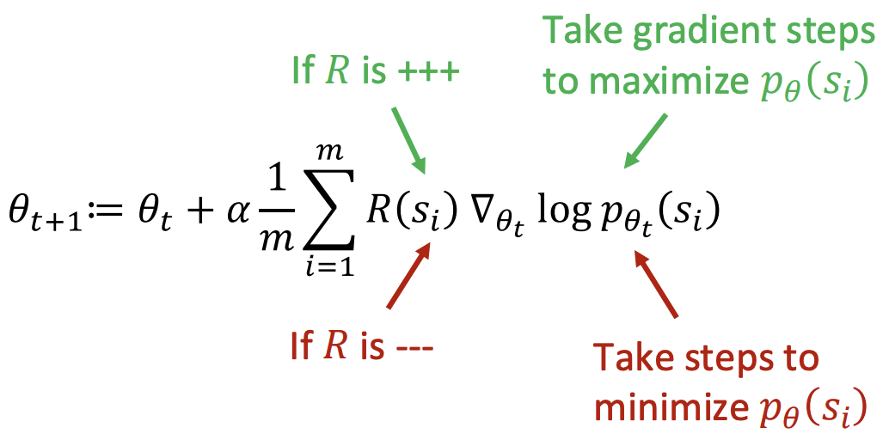

- How do we get the rewards?
  
  - Problem 1: Human-in-the-loop is expensive
    
    - Solution: humans label a limited amount → **reward model** $RM_\phi(x,y)$ learns → model optimization uses reward model.

  - Problem 2: Human judgments are noisy and miscalibrated
  
    - Solution: ask for **pairwise comparisons**

-  Reward model training with pairwise comparisons (Bradley–Terry)

    - For each prompt $x$, you have two outputs:
      
      - $y^w$: the winning (preferred) output
      
      - $y^l$: the losing output
    
    - the reward model outputs $RM_\phi(x,y)$ is a single number

    - You train $RM_\phi$ so that $RM_\phi(x, y^w)$ should be higher than $RM_\phi(x, y^l)$

    - Loss:

        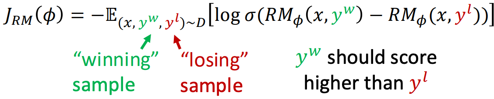
        
        - $\Delta = RM_\phi(x,y^w) - RM_\phi(x,y^l)$
        
        - Apply $\sigma(\Delta)$ (a sigmoid) → turns it into a “probability that the winner beats the loser”
        
        - Maximizing $\log \sigma(\Delta)$ pushes $\Delta$ to be positive and large, i.e., winner gets higher score than loser

**\>>** RLHF (e.g., PPO) is one way to do that; DPO is another approach that uses preference data more directly

### RLHF

#### Pipeline

1. Supervised fine-tuning (SFT)

2. Train a reward model from comparisons

3. Optimize the language model against the reward model

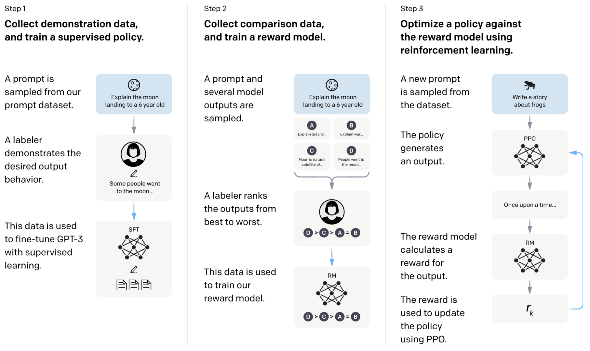

#### Optimizing a learned reward model

- Before RLHF, we have:
  
  - A base LM $p^{PT}(y\mid x)$
  
  - A reward model $RM_\phi(x,y)$ trained from human comparisons (pairwise preferences)

- Steps:
  
  - Create a copy of the base LM as the policy you will update $p^{RL}_\theta(y\mid x)$
  
  - Then optimize the policy to increase reward: $\max_\theta \ \mathbb{E}_{\hat{y}\sim p^{RL}_\theta(\cdot\mid x)}\big[RM_\phi(x,\hat{y})\big]$

- Risk: **learned rewards are imperfect**
  
  - Add a penalty for drifting too for from the initialization

    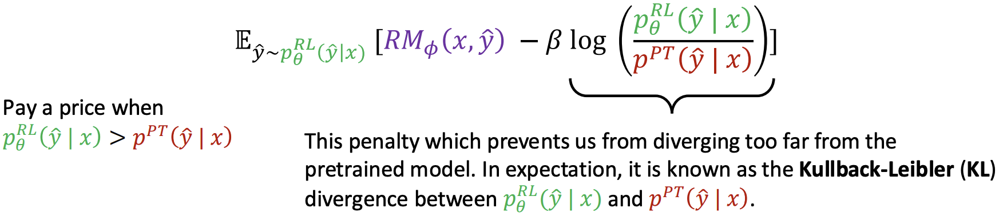

    - Reward term = “be more preferred”
    - KL term = “but don’t become a totally different, exploitable model”
    - β controls the tradeoff:
      - larger β = stay closer / safer / less change
      - smaller β = chase reward more aggressively (higher risk of reward hacking)

### Direct Preference Optimization (DPO)

#### Why move beyond RLHF? >> RLHF can be complex

RL optimization can be computationally expensive
and tricky:

- Fitting a value function
- Online sampling is slow
- Performance can be sensitive to hyperparameters

#### Simplify RLHF? → Towards DPO

Current RLHF pipeline:

1. Train a reward model $RM_\phi(x,y)$ using a **dataset of human comparisons**
2. Optimize a pretrained/instruction-tuned LM $p^{PT}(y\mid x)$ into an RLHF policy $p^{RL}_\theta(y\mid x)$

**\>>** means: maintain two training problems (reward modeling + RL), plus the complexity of RL optimization.

**Core idea:** derive $RM_\phi(x,y)$ in terms of $p^{RL}_\theta(y\mid x)$; optimizing parameters $\theta$ by fitting $RM_\theta(x,y)$ to the preference data instead of $RM_\phi(x,y)$

#### Steps

Recall, objective: 

Closed-form solution:

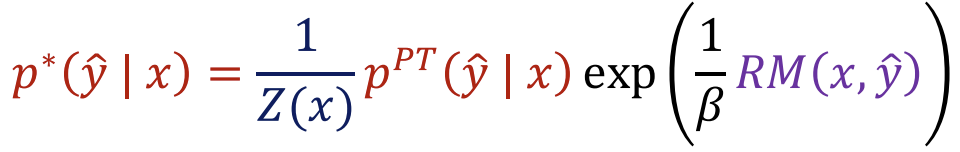

Rearrange the terms:

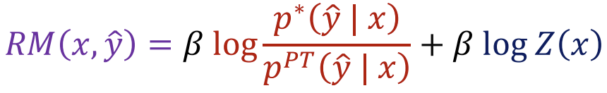

> 从 KL-regularized RLHF 目标能推到闭式解 $p^*$，如果知道真实 reward$ RM(x,y)$，那最优策略就是 $p^*$，但是不知道，我们只知道当前的策略

Define an implicit reward for any policy $p^{RL}_\theta$:

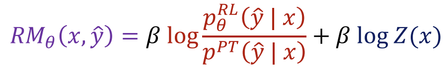

Recall the reward-model loss (Bradley–Terry style):

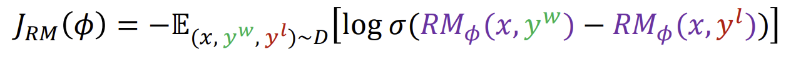

We only need the difference between the rewards
for $y_w$ and $y_l$. Plugging in the implicit reward $RM_\theta$, the $\log Z(x)$ cancels out, yielding:

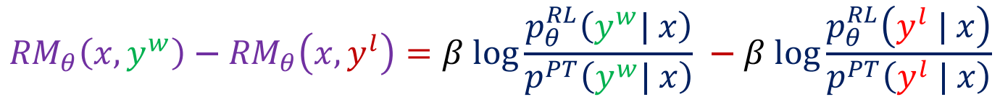

**\>>** The final **DPO loss function** is:

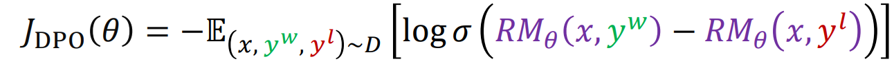

We have a simple **binary classification loss** function that connects preference data to language
model parameters directly

### DPO v.s. RLHF

**Shared goal**: Optimize for human preferences using rankings/comparisons

RLHF (classic)
- Train an **explicit reward model**.
- Optimize the LM to maximize reward under a **KL constraint**.
- Can be very effective, but **expensive and tricky**.

DPO
- **No** explicit reward model, **no** RL loop.
- Optimize LM parameters **directly on preference pairs** via a classification-style loss.
- Simple and effective; similar “KL-to-reference” flavor.
- **does not leverage online data** in the same way RL can (i.e., no RL sampling loop as the core mechanism).

## Frontier and Challenges

### Limitations of RL + Reward Modeling

1. Human preferences are unreliable
   
   1. **Reward hacking**: In RL, the model learns to maximize the reward signal, not necessarily the real goal. If the reward is imperfect, the model may find shortcuts that look good to the evaluator but are actually wrong.

   2. **Hallucinations**: the model makes up facts, dates, citations, or events, because confident, fluent answers often get higher preference than cautious or uncertain ones.

2. Reward models can be even more unreliable

   Humans are noisy, and RM is an approximation of humans → can be wrong in systematic ways.

3. **Misalignment risk**
   
   Optimizing models to “please humans” (or to please a reward model) is not the same as optimizing for what we actually want (truthfulness, safety, robustness). As models get more capable, these gaps can become more important.

### What’s next?

The core recipe (SFT → preferences → optimize) is **still common**, but the field is **moving quickly**, with many proposed improvements.

RLHF is data-expensive (human labels cost money/time).
   
#### Direction 1: RL from AI Feedback (RLAIF)

Problem: Humans-in-the-loop are expensive.

Idea: Use an AI model to generate feedback that approximates human judgments.

Main risk: If the AI judge is wrong or biased, you may scale the wrong signal.

#### Direction 2: “Constitutional AI” style supervision

**Train the model to self-critique and self-correct** according to explicit rules, so you need fewer human edits.

#### Direction 3: Finetuning LMs on their own outputs (self-improvement)

- Let the model produce solutions (often with reasoning steps),

- select/filter the better ones (using heuristics, verifiers, or another model),

- then finetune on those “good” outputs.

Key caution: Self-training can reinforce mistakes if the filtering/verifier is weak.

#### Direction 4: Personalization and pluralism

Motivation:

- “Human preference” is not a single universal thing.

- Preferences differ by:

  - culture, language, norms

  - individual goals (tone, level of detail, safety strictness)

Research goal:

- Collect feedback from diverse users

- and align models in a way that can reflect different preferences, not just one averaged standard.