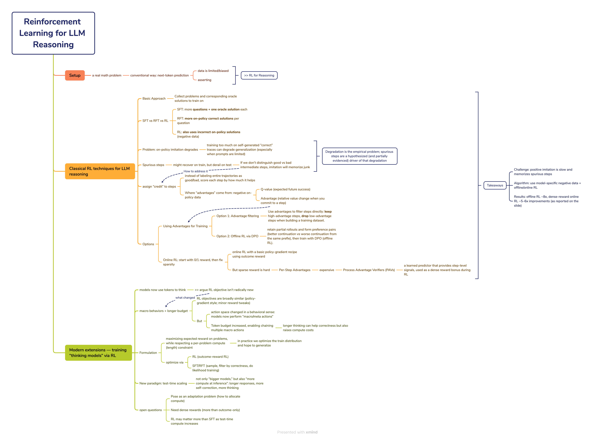
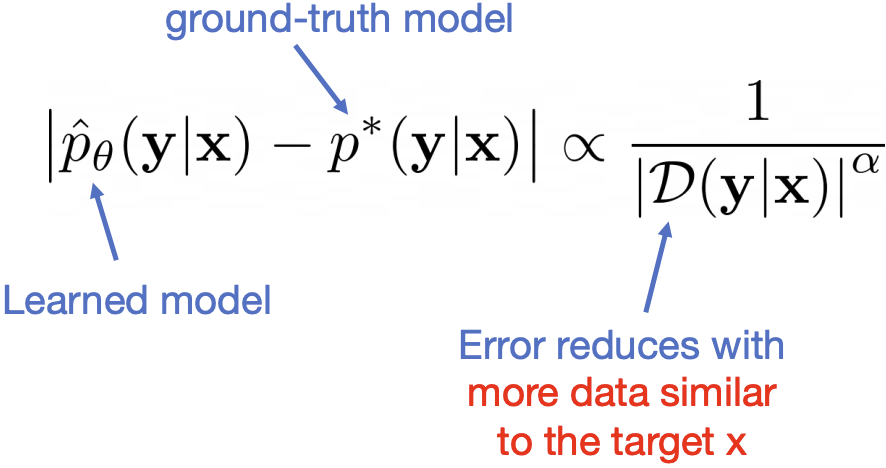
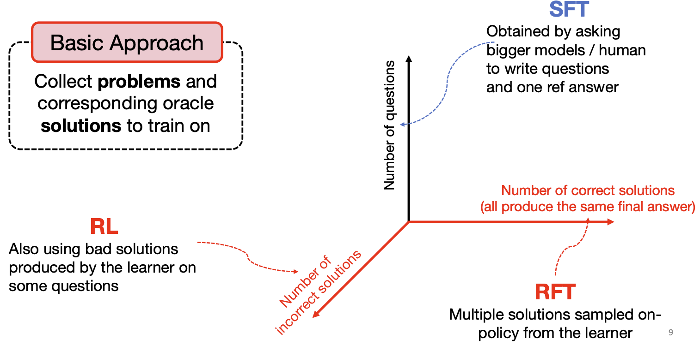
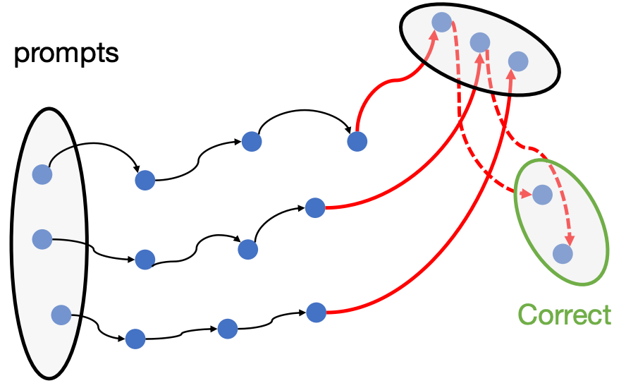
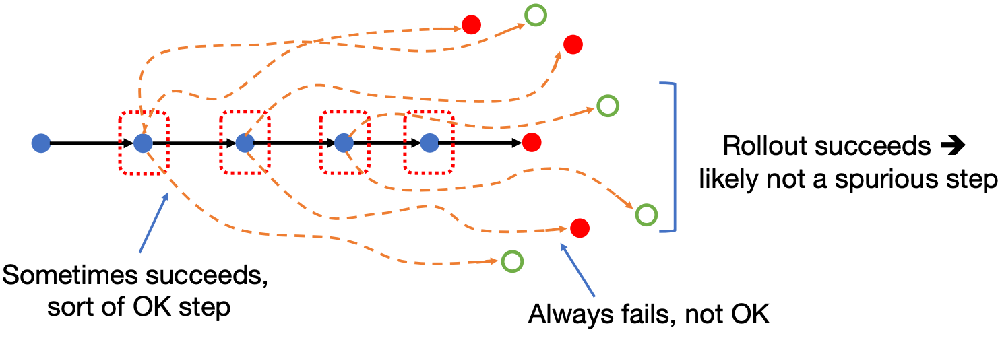
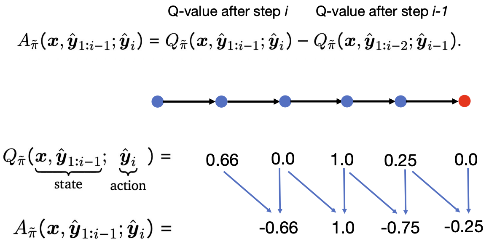
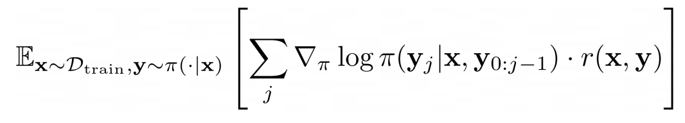
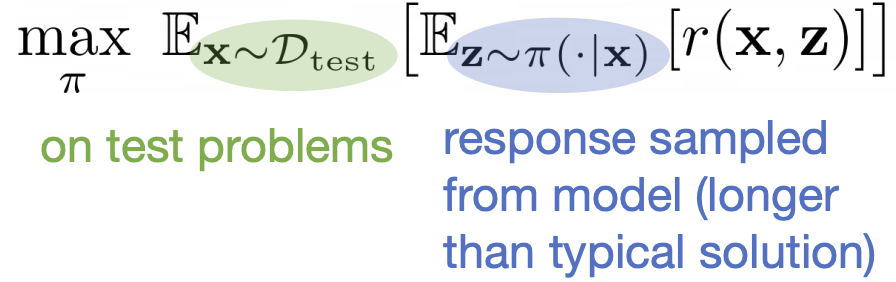
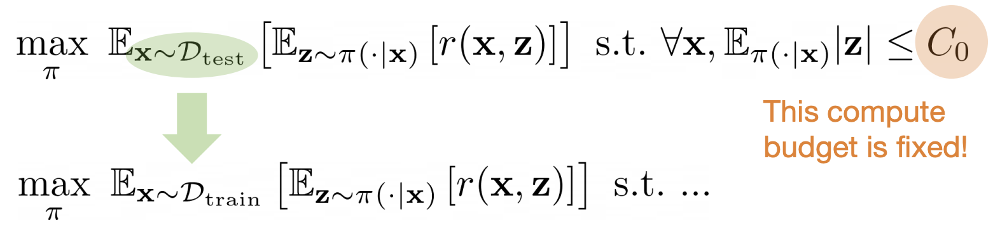

# Reinforcement Learning for LLM Reasoning

## Setup

**Two styles of solutions**:

- **Thorough** solution: step-by-step, explains why each transformation is valid.
- **Quick** solution: shorter, uses a key trick and skips details.

**Multi-step reasoning** **>>** the model must pick helpful intermediate steps, not just the final answer

**The Conventional Way of Training**: Standard LLM training = predict the next token (language modeling)

**\>>** But,

1. in Many Problems, **Data is Limited/Biased**

2. and Training on Current Data is Not Enough
   
   - focus on **local/term-by-term analysis** that doesn’t solve the whole problem
   
   - **assert** a conclusion without actually proving it
   
   - fail to notice mistakes and **not backtrack**.

**\>>** RL for Reasoning

RL is presented as a toolbox to make reasoning learning **more efficient and more robust** than naive “learn from existing solutions only.”

**Problem Setup**: 

Treat reasoning as a sequential decision-making problem (an **MDP** (Markov Decision Process))

Once you accept “reasoning = sequential actions,” RL naturally applies:

- you can optimize policies for correctness,

- and you can try to design better training signals than only final 0/1 reward.

## 1.	Classical RL techniques for LLM reasoning

**Three training regimes using a data scaling**

1) **SFT (Supervised Fine-Tuning)**
   
   - Data: collect many problems and one oracle solution per problem.
   - Scaling happens mainly by **increasing the number of questions** (and having reference answers).  

2) **RFT (Rejection/Response Fine-Tuning; on-policy sampling)**
   - Data: keep questions fixed, then **sample multiple solutions** from the current model (“on-policy”).
   - Scaling happens by increasing **the number of correct solutions per question** (many correct traces that lead to the same final answer).  

3) **RL (Reinforcement Learning)**
   - Key difference: RL can also **use bad/incorrect solutions** produced by the learner as training signal.  
   - Scaling happens by increasing **the number of incorrect solutions**

> **Takeaway**
> 
> - SFT mostly learns from **gold answers**.
> - RFT learns from **self-generated correct** answers.
> - RL learns from **both success and failure**, which can improve learning efficiency.

**But >>**

Performance improves with more data, but with diminishing returns.

Observation: On-policy imitation eventually degrades if you train too much on it.

> **on-policy imitation**: You generate solutions using your current model, then you do SFT-style training to imitate those generated solutions.

**Why worse**: Fitting self-generated data on limited initial states can **hurt generalization** on new initial states (prompts)

### Spurious Steps Derail the Model

Spurious steps:

- can somehow learn to recover on train
- but not on test, where it will derail.

> **Spurious step**: an intermediate reasoning move that seems fine (or is tolerated) during training, but is **not** reliably correct or helpful, and can cause failure when the model can’t recover at test time. 
>
> 训练集上，模型“走错一步”也经常能靠后面的步骤把结果救回来；但测试集上遇到新题/新分布时，走错那一步就更容易一路错到底，最终崩掉

### How do we avoid learning those bad steps?

**Intuition**

- Don’t treat an entire solution as simply “good” or “bad”.
- Instead, evaluate each step: Did this step increase or decrease the chance of solving the problem correctly?

**>> Negative On-Policy Data**

> - On-policy = generated by the current model
> - “Negative” = trajectories that fail (wrong answer)

Failures give information about which steps are risky.

**Formalizing**

1. **Q-value** definition

    

   - **state** = the problem $x$ + the partial solution so far $\hat y_{1:i-1}$

   - **action** = the next step $\hat y_i$

   - $Q_{\tilde\pi}(x,\hat y_{1:i-1};\hat y_i)$
     - Fix the step $\hat y_i$,
     - then **roll out** (continue generating) the rest of the solution many times using a policy $\tilde\pi$,
     - and measure the average final reward (e.g., 1 if the final answer is correct, else 0)

2. **Advantage** definition 

    > Advantage: **relative change** in the value function having committed to a step
    
    
    
   - **Positive** advantage: this step makes success more likely → good step
   - **Near zero**: this step doesn’t change much → neutral step
   - **Negative** advantage: this step makes success less likely → bad / spurious step

    Advantage gives a practical way to detect and down-weight spurious steps

**Using Advantages for Training**

1. Option 1: Filter steps by advantages **directly**

   1. generate solution traces from a base policy $\pi$
   2. For each step, compute an advantage score
   3. Then keep only the “good” steps (large positive advantage)
   4. drop steps with very negative advantage, even if they appear in a correct-looking solution

2. Option 2: Retain partial rollouts for training (DPO)

    > **offline RL**: build a fixed dataset first (no more environment interaction during training), then train from that dataset

    1. Generate many rollouts from the current model
    2. Keep partial rollouts, not just full solutions
    3. From the same prefix, collect multiple candidate continuations
    4. Use advantages to decide which branch is better
    5. Turn this into preference pairs
    6. Train with DPO (offline)

**Option 3: Online RL**

> **online RL**: The model is updated using fresh samples generated by the current model (current policy $\pi$), which is different from offline training, where the dataset is fixed.

**Start**

Key idea: Train with a binary 0/1 reward using policy gradients

- The model increases the probability of the tokens/steps it produced when reward = 1, and decreases them (or doesn’t reinforce them) when reward = 0.

- The sum over $j$ means: we apply learning signal to all steps/tokens in the generated trajectory.

Can also use other policy gradient methods (PPO, GRPO, etc)

**Problem**

0/1 is too sparse; we’d like per-step training signals (advantages)

**\>>** Per-Step Advantages

- Why: A per-step advantage is a dense, step-level learning signal. If we had this signal, learning would be faster than using only final 0/1.

- Instead of computing advantages with lots of rollouts every time, we **fit a parametric model** (a neural net) to predict advantages.

**Challenge**

Online RL wants step-level feedback, but exact computation is too costly >> learn a predictor

**\>>** Process Advantage Verifiers (PAVs)

A Process Advantage Verifier is a trained model that takes the problem + the partial reasoning so far (and possibly the next step), and outputs an estimate of advantage / step quality.

It plays a role similar to a judge: it “verifies” whether a step looks like progress or a mistake (in expectation).

Online RL still uses the final outcome reward (0/1), but PAV predictions can be added as a dense reward bonus at each step:
  - good steps get extra positive signal,
  - bad steps get negative signal,
which helps credit assignment and speeds up learning.

> **Takeaway**
>
> - Option 1（用 advantage 做训练）：直接用 advantage 过滤/挑选步骤，再去做（per-step）RFT/SFT。
> - Option 2（用 advantage 做训练）：把 advantage 用来构造 偏好对（preference pairs），然后做 offline RL / DPO。
> - Online RL：直接用 在线采样 + policy gradient 去优化 reward（先从 0/1 outcome reward 开始），然后再引出 per-step advantages / PAVs 来把奖励变“更稠密”。
>
> Challenge: Why “just imitate correct solutions” is not enough
>   - Imitating positive data means training on solutions that end up correct (SFT / RFT-style). This can improve performance, but it scales **slowly**
>   - More importantly, positive-only imitation can accidentally teach **spurious steps**
>
> Algorithm idea: Use model-specific negative data + RL to fix spurious steps
>   - Negative data = the model’s own incorrect solutions (failures)
>   - Model-specific = these failures come from the current model, so they reveal the exact kinds of mistakes this model tends to make
>   - Using both success and failure enables offline RL or online RL methods to:
>      - identify which steps are helpful vs harmful (via advantages / step credit),
>      - and reduce the chance of learning spurious steps.
>
> Results: Efficiency improvements (what the numbers mean)
>   - Offline RL (e.g., per-step methods like DPO with preference pairs) can achieve about 8× better sample efficiency than imitation-only.
>   - Online RL with dense advantage reward (e.g., using PAV-like step rewards): improves sample efficiency by about 5–6× compared to using only final 0/1 outcome rewards.

## Training “Thinking” Models via RL

A “thinking model” spends tokens on process, not just answer.

**What Changed?**

1. RL objectives are mostly the same
2. The action space changed: better at macro actions, such as verification, backtracking, planning, revisiting an earlier step.
3. Token budget increased

**Formulation**

Objective: 

We want a policy/model $\pi$ that, on test problems $x$, generates responses $z$ that get high reward $r(x,z)$.

Budget constraint (not allowed infinite thinking): For each problem, expected response length is bounded by a budget $C_0$ 

How to optimize:

- RL route: do outcome-reward RL (DeepSeek-R1).
- SFT/RFT route: generate many samples, keep correct ones, then do maximum-likelihood training.

**“Action” Space**: Incorporating Meta Strategies

Thinking models learn to use “meta strategies” as part of their behavior:
- Verifications (“Let me check…”)
- Subgoal setting (“Let’s aim for…”)
- Backtracking (“Let’s try a different approach…”)
- Backward chaining (“Work backwards…”)

RL can amplify helpful strategies if the model can represent and learn them.

**Longer Length**: RL Training Amplifies Length

If reward is based mainly on correctness, then writing more tokens can:
- allow extra checks,
- explore alternate paths,
- recover from mistakes.

So RL may “discover” that longer responses improve reward—unless you strongly penalize length.

**A New Paradigm: Test-Time Scaling**

Two ways to get better:

1. Bigger model (train-time scaling): increase parameters, train more.

2. More test-time compute (test-time scaling): keep model fixed, but allow:
   - longer responses,
   - more “thinking,”
   - self-correction.

\>> Performance can improve not only by bigger models, but also by more computation at inference.

**Open Directions**

1. Desiderata & Formulation
   
   Treat thinking as an adaptation problem: allocate extra compute at test time to search over responses and find correct answers.
   > 在每道测试题上，模型要“自适应地”分配有限的推理计算量（比如 token / steps / 多次尝试），从而最大化最终正确率

2. Ingredient 1: Dense rewards

    Outcome-only (0/1) reward is not enough. We want dense reward signals that give feedback during the reasoning process.

3. Ingredient 2: RL >> SFT

    RL can outperform pure SFT/distillation as test-time compute grows. Use reward signals for training, not only imitation.