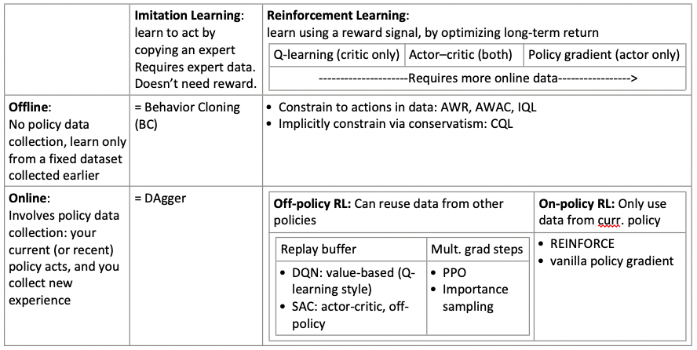
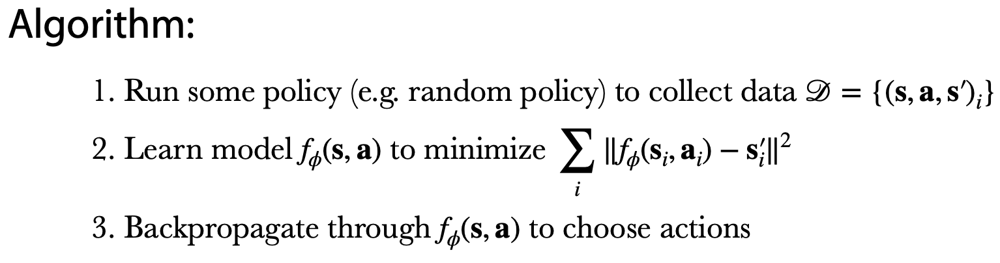
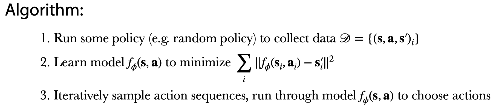
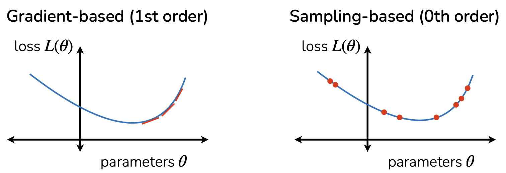
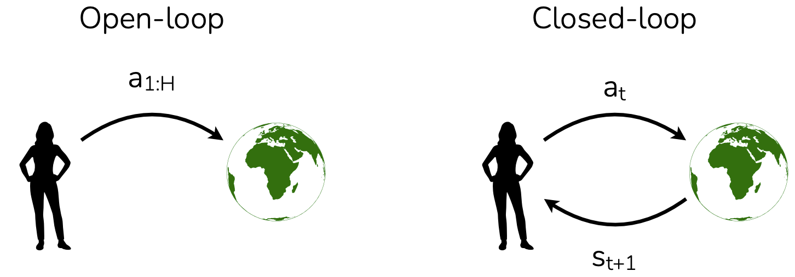
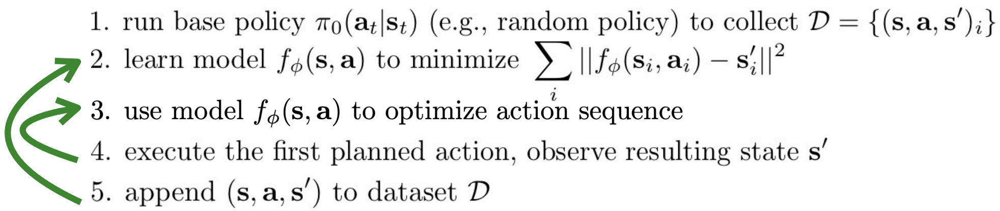
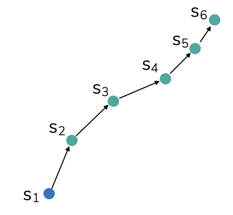
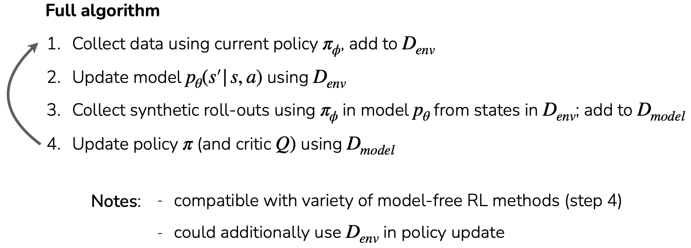

# Model-Based Reinforcement Learning

> **Recap:**
> 

## Model-based reinforcement learning
### Key idea

#### Simulator

A (learned) simulator is a dynamics model that predicts the next state $s_{t+1} \approx f(s_t, a_t)$

If we can learn $f$, we can:
- “Imagine” futures without real-world interaction (cheaper/safer)
- Plan by trying many action sequences inside the model
- Do model-based RL: use the learned model to help learn a good policy

Examples:
- **Robotics / physical systems**: learn physics-like transitions from sensor data; sometimes “video prediction conditioned on actions”.
- **Finance**: try to predict market evolution (hard, noisy, non-stationary).
- **Games**: learn game rules; sometimes you don’t need to learn the model if rules are known (e.g., chess). May also need to model other players (multi-agent aspect).

#### Notional learned simulator algorithm (a simple pipeline)

1. **Collect data**: $\mathcal{D} = \{(s_i, a_i, s'_i)\}$ collected by some base policy $\pi_0(a|s)$

    > run some behavior (maybe random, maybe an expert, maybe an existing controller) and record transitions
    > 
    > **\>> What might go wrong**: Data coverage matters a lot

2. **Fit the simulator with supervised learning**: Learn $f(s,a)$ so that $f(s_i,a_i)$ matches the observed next state $s'_i$: $\min_f \sum_i \|f(s_i,a_i) - s'_i\|^2$
    
    > just regression: input = (state, action), target = next state
    > 
    > **\>> What might go wrong**: Modeling is domain dependent. Some domains much easier to simulate than others

3. **Do RL “inside” the learned simulator**: Run your favorite RL algorithm using model-generated rollouts or do planning (search over action sequences)

    > **\>> What might go wrong**: Even with a good model, “RL inside it” isn’t automatically easy. You must account for model inaccuracies, e.g.:
    > - Prefer short-horizon planning (re-plan often)
    > - Penalize uncertainty / be conservative
    > - Use ensembles to estimate uncertainty
    > - Mix real data and model rollouts carefully

### How to learn a dynamics model? (in brief)

A dynamics model predicts how the world changes $s_{t+1} \approx f(s_t, a_t)$

Three practical cases (depending on how much you already know about the environment’s physics/rules):

1. You already know the dynamics (e.g. some games)
2. You approximately know most of the dynamics (e.g. certain physical models)
   
   **\>>** Use data to fit unknown parameters

3. You don’t know the dynamics (most real scenarios)
   
   1. Option A: Learn it end-to-end 
      
      **\>>** Directly train a model $f_\theta(s,a)\to s'$ from data

   2. Option B: Learn a low-dimensional state representation first
      
      **\>>** If observations are high-dimensional (images), first learn a compact latent state $z = \phi(o)$. Then learn dynamics in latent space: $z_{t+1} \approx g(z_t, a_t)$

### How to use a learned dynamics model?
#### Planning

##### Approach 1: Optimize over actions using model

You have:
- a learned dynamics model $f_\phi(s,a)\approx s'$
- a reward function $r(s,a)$

Goal: 

$$\max_{a_{t:t+H}} \sum_{t'=t}^{t+H} r(s_{t'}, a_{t'})$$

choose an action sequence $a_t, a_{t+1}, \dots, a_{t+H}$ that gives the highest predicted total reward over horizon $H$, where states are generated by rolling out the model $s_{t'+1} = f_\phi(s_{t'}, a_{t'})$

###### Approach 1a: via backpropagation (i.e. gradient-based optimization)

###### Approach 1b: via sampling (i.e. gradient-free optimization)

1. Version 1: Random shooting (“guess & check”)
   
   1. Sample N action sequences A_1,\dots,A_N from some distribution (often uniform or Gaussian noise)
   2. Evaluate each with the model: $J(A_i)=\sum_{t'=t}^{t+H} r(s_{t'},a_{t'})$
   3.  Choose the best one (highest J)

2. Version 2: Cross-Entropy Method (CEM)
 1. Sample many sequences from a distribution $p(A)$ (often Gaussian)
 2. Score them with model rollouts $J(A)$
 3. Keep the top $M$ elite sequences
 4. Refit $p(A)$ to those elites (update mean/variance)
 5. After a few iterations, output the best sequence found

   - pros:
     - fast, if parallelized
     - simple
   - cons:
     -  doesn’t scale to high dimensions 
     

###### Gradient-based v.s. sampling-based optimization

- Gradient-based (1st order): uses $\nabla$ (slope information)
  - ✅ scales better to high dimensions
  - ✅ often great with big neural nets / overparameterized models
  - ❌ needs usable gradients / nicer landscape

- Sampling-based (0th order): uses only function values $J(\cdot)$ (no gradients)
  - ✅ very parallelizable (evaluate many sequences at once)
  - ✅ works even if actions are discrete or model isn’t differentiable
  - ❌ scales poorly as dimension grows
    > $\text{search dimension} \approx H \times |a|$ (horizon length × action dimension). As either grows, brute-force sampling becomes hard.

###### Improvement

Main failure mode: data distribution mismatch

$$p_{\pi_0}(s) \neq p_{\pi_f}(s)$$

\>> Simple mitigation: collect data where you actually go (online dataset aggregation)

4. Execute planned actions, append visited tuples $(s,a,s')$ to dataset $\mathcal{D}$

\>> So the loop becomes:
  
plan with model → act in real env → add new data → retrain model → plan again

Why it helps: your dataset gradually shifts toward the states the improved policy actually visits, reducing the mismatch $p_{\pi_0}(s)$ vs $p_{\pi_f}(s)$

###### Open-loop v.s. closed-loop planning

- Open-loop: chooses the entire sequence $a_{1:H}$ upfront. If anything unexpected happens (model error, noise), the rest of the plan is now wrong.

- Closed-loop: act, observe, then decide again using the new observation.

##### Approach 2: Plan & replan using model (model-predictive control (MPC))

Replanning corrects for model errors because you re-anchor on the true observed state every step (or every few steps).

- ✅ replan to correct errors
- ❌ computationally heavy (you’re solving a planning problem repeatedly)

> **Summary**
>
>  1. Plan $a_1,\dots,a_H$ via gradient-based or sampling-based optimization
>  2. Update the model using data collected from the (re)planning behavior
>  3. Replan periodically to handle mistakes
> 
> Pros
> - Simple
>  - Easy to swap goals/rewards (even at test time
> 
> Cons
> - Compute-intensive at test time
> - Usually practical only for short horizons
>
> Why short horizons?
> 1. long-horizon planning is too expensive
> 2. the learned model becomes inaccurate as you roll out longer (errors compound)

#### Learned policy

##### Option 1: Distill the planner into a policy

Idea:

> 先用 planner 生成大量“正确答案”，再训练一个策略网络学会“直接输出答案”

 - Run a strong planner (e.g., MPC with CEM) to decide actions.
 - Treat the planner as a “teacher”.
 - Train a neural policy $\pi_\phi(a|s)$ to imitate the planner’s chosen action.

Pros / Cons:

 - ✅ Not compute-intensive at test time (just one policy forward pass)
 - ❌ Still often limited to short-horizon issues
   - because the planner you imitate is usually short-horizon (due to model error / compute)
   - imitation inherits planner limitations

\>> Longer-horizon with a model:

1. Plan with terminal value function

    > Instead of planning for a very long horizon, plan for a shorter horizon $H$ but add a “tail estimate”:
    > $$\sum_{t'=t}^{t+H} r(\cdot) \;+\; V(s_{t+H})$$
    > - V(s) estimates “how good things will be after the planning horizon.”
    > - This is a classic trick to extend effective horizon.

2. Augment model-free RL methods with data from model

##### Option 2: Use model to generate data for model-free RL

Key idea: augment data with model-simulated rollouts

You have real trajectories from the environment:

\>> How to augment?

###### Option A: Generate full trajectories from initial states

Start from $s_1$ and roll out the model for many steps.

Problem: model error compounds → long-horizon predictions become unreliable.

###### Option B: Generate partial trajectories from initial states

Start from $s_1$, but only roll out for a short horizon (e.g., 1–5 steps).

Problem: you may still not cover later states well (you keep starting near the beginning).

###### Option C: Generate partial trajectories from all states in the data ✅

### When to use model-based RL

- ✅ Immensely useful, **far more data efficient** if model is easy to learn
- ✅ Model can be trained on data **without reward labels** (fully self-supervised)
- ✅ Model is somewhat **task-agnostic** (can sometimes be transferred across rewards)

- ❌ Learning a good model does **not directly optimize task performance**
- ❌ Sometimes the model is **harder to learn than the policy**
- ❌ Another thing to train, more hyperparameters, more compute intensive

### Other kinds of “models” (beyond forward dynamics)

> Different model forms serve different purposes; forward dynamics is only one choice.

So far: forward model $p(s_{t+1}\mid s_t,a_t)$

Alternatives:

1. Inverse model $p(a_t \mid s_t, s_{t+1})$

    Given start and next state, predict what action caused it. Useful for imitation / representation learning / control hints.

2. Multi-step inverse model $p(a_t \mid s_t, s_{t+n}) \quad$ or $\quad p(a_{t:t+n}\mid s_t, s_{t+n})$

    Predict the action(s) needed to reach a future state after n steps.	Can act like a “shortcut planner”.

3. Future prediction without actions $p(s_{t+1:t+n}\mid s_t)$
    
    Predict likely futures even without knowing actions (useful in passive video / forecasting).

4. Video interpolation $p(s_{t+1:t+n}\mid s_t, s_{t+n+1})$
    
    Fill in missing frames between two endpoints.

5. Transition distribution modeling $p(s_t, a_t, s_{t+1})$
    
    Model the joint distribution; can support different inference queries.

## Case study in dexterous robotic manipulation

Model-based RL can learn complex robot-hand manipulation efficiently, sometimes faster than model-free RL, by combining:

- a learned dynamics model (neural networks),
- a sampling-based planner (CEM / MPC),
- and an iterative data collection + model update loop.

State space: Hand + object positions (i.e., information describing the configuration of the robot hand and the manipulated object).

Action space:

- Control signals for a 5-fingered hand with 24 degrees of freedom (DoF).
- High-dimensional continuous control → difficult for naive search.

Reward:

- Track a target object trajectory (follow a desired motion/path),
- plus a penalty for dropping the object.

Dynamics model:

- An ensemble of 3 neural networks
- Each network has 2 hidden layers of size 500
- Purpose of the ensemble:
  - improves robustness,
  - gives a sense of uncertainty / reduces overfitting to model errors.

Planner:
- A modified CEM optimizer (sampling-based planning).
- Two important modifications mentioned:
	1.	Softer reward-weighted mean (instead of hard “top-k only” elites): update the sampling distribution using smoother weighting, which can stabilize planning.
	2.	Temporal smoothing on actions: encourages action sequences that change smoothly over time (important for real robot control).

Data collection loop:

1. collect ~30 trajectories using the current planner (in the real/sim environment),
2. update the dynamics model using the newly collected data,
3. repeat.

Results: 

- More efficient than model-free methods
- More performant than other model-based methods

Ablations:

- Need sufficiently large model
- Need at least 3 ensemble members
- Planning horizon trade-offs
- Modified CEM is crucial

